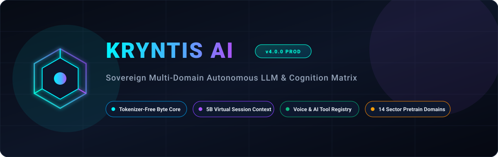
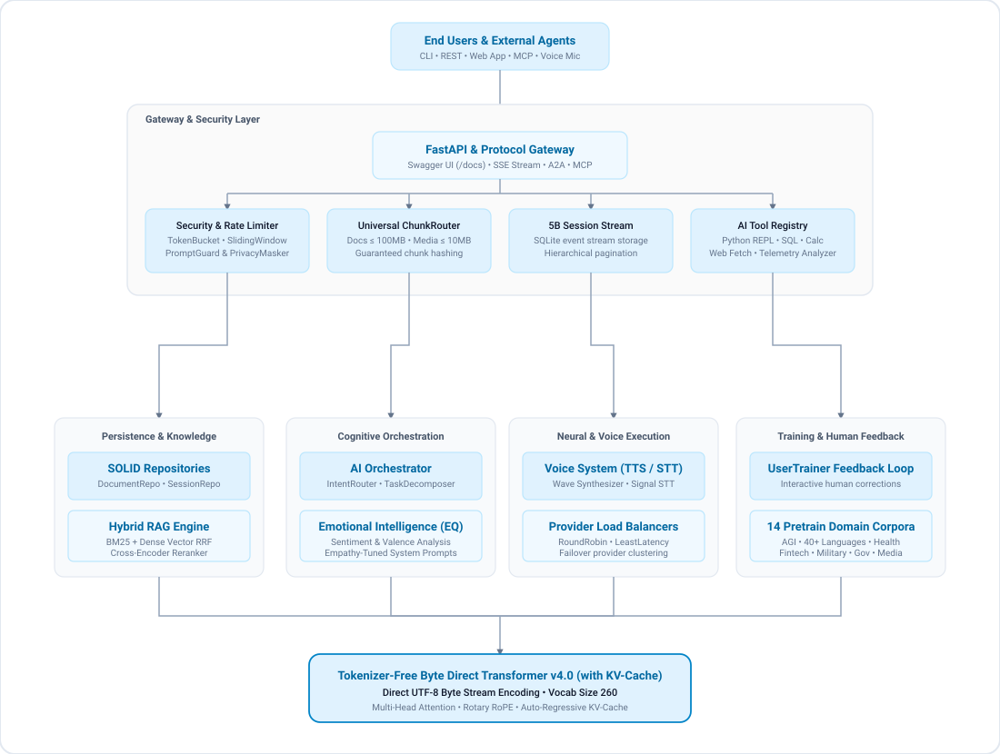

# Kryntis AI — Sovereign Multi-Domain Autonomous LLM Platform



**Version:** `4.0.0` (Production Release)  
**Architecture:** Tokenizer-Free Byte / ASCII Direct Transformer Engine (with KV-Cache)  
**Platforms:** macOS (Apple Silicon & Intel), Windows 10/11 (PowerShell & WSL), Linux (Ubuntu, Debian, RHEL)  
**API Specification:** Interactive OpenAPI 3.1 & Swagger UI at `/docs`, ReDoc at `/redoc`  
**IDE UI Integration:** PyCharm Run Configurations (`.idea/runConfigurations/`) & VSCode Launch/Tasks (`.vscode/`)

---

## High-Level Overview

Kryntis AI is an offline-first, sovereign, multi-domain autonomous large language model platform engineered from the ground up for privacy-critical environments, research institutions, and enterprise edge computing.

### Functional Overview
- **Zero-Cloud Sovereignty:** Operates 100% locally on consumer laptops, workstations, or private server clusters without transmitting prompts, embeddings, or training samples to third-party APIs.
- **14 Domain-Specific Cognitive Engines:** Pre-configured architectures and synthetic data pipelines tailored for Coding, Artificial General Intelligence (AGI), Healthcare, FinTech, Military, Government, Media, Legal, CyberSecurity, Education, Logistics, Energy, Autonomous Systems, and Scientific Research.
- **Multimodal Interaction Surface:** Supports rich terminal interactions via an interactive REPL with a built-in Vim modal editor, OpenAPI 3.1 REST endpoints with Swagger UI and ReDoc, Model Context Protocol (MCP JSON-RPC 2.0), Agent-to-Agent (A2A) standard, and bidirectional voice (TTS/STT) ([assistant.py](file:///E:/Personal/Kryntis%20AI/kryntis-llm-local/kryntis/voice/assistant.py)).
- **Continuous Human-in-the-Loop Alignment:** Features interactive teaching loops and feedback-driven gradient training enabling models to learn from operator corrections directly in real time.

### Technical Overview
- **Tokenizer-Free Byte-Level Architecture:** Employs direct UTF-8 byte stream processing across a compact 260-token vocabulary ([`byte_processor.py`](file:///E:/Personal/Kryntis%20AI/kryntis-llm-local/kryntis/core/byte_processor.py)), eliminating out-of-vocabulary anomalies, subword fragmentation, and tokenizer vulnerability vectors.
- **Decoder Transformer with KV-Cache:** Built on an autoregressive decoder featuring Rotary Position Embeddings (RoPE), SwiGLU feedforward activation networks, and dynamic Key-Value caching for low-latency generation ([`KryntisTransformer`](file:///E:/Personal/Kryntis%20AI/kryntis-llm-local/kryntis/core/model.py)).
- **5-Billion Token Virtual Context Stream:** Implements long-term memory persistence and streaming context management via SQLite-backed session repositories ([`SessionRepository`](file:///E:/Personal/Kryntis%20AI/kryntis-llm-local/kryntis/repositories/session_repository.py)).
- **Hybrid RAG Retrieval Engine:** Fuses lexical BM25 search with dense vector semantic search using Reciprocal Rank Fusion (RRF) and Cross-Encoder neural reranking ([`HybridRAGEngine`](file:///E:/Personal/Kryntis%20AI/kryntis-llm-local/kryntis/rag/hybrid_rag.py)).
- **Dynamic Multi-Provider Load Balancing:** Intelligent routing supporting Round-Robin, Weighted, and Least-Latency strategies across local PyTorch checkpoints and optional external backends ([`ModelManager`](file:///E:/Personal/Kryntis%20AI/kryntis-llm-local/kryntis/core/model_manager.py), [`LoadBalancer`](file:///E:/Personal/Kryntis%20AI/kryntis-llm-local/kryntis/core/load_balancer.py)).

---

## Background Context

Generative AI adoption across enterprises and personal workflows has introduced severe systemic challenges:
1. **Centralized Cloud Lock-in & Surveillance Risks:** Standard commercial LLMs mandate relaying sensitive code, proprietary algorithms, personal conversations, and compliance records across external cloud networks, violating privacy mandates (GDPR, HIPAA, GLBA, defense regulations).
2. **Tokenizer Failure Modes:** Subword tokenizers (BPE, SentencePiece) struggle with non-English languages, proprietary code syntax, corrupted byte sequences, and binary inputs, causing token inflation and semantic distortion.
3. **Hallucination & Lack of Auditability:** Mainstream models often generate confidently incorrect assertions without deterministic grounding verification, causal sanity checks, or adversarial falsification audits.
4. **Hardware Inefficiency:** High-end models require massive distributed GPU clusters, leaving local workstations and edge hardware unable to run private, intelligent systems autonomously.

Kryntis AI solves these friction points by delivering a tokenizer-free, lightweight, mathematically grounded, and sovereign AI operating layer capable of running entirely offline on standard consumer or server hardware.

---

## Goal

The core mission of Kryntis AI is to provide a complete, sovereign, zero-leakage cognitive stack with the following objectives:
1. **True On-Premise Sovereignty:** Ensure all model weights, tokenizer operations, context databases, and vector stores reside strictly within the local host environment.
2. **Universal Byte Processing:** Eliminate vocabulary boundaries and out-of-vocabulary tokens via direct UTF-8 byte modeling.
3. **5-Billion Token Persistent Context:** Stream and persist lifelong conversational and document memory across local SQLite repositories without memory amnesia.
4. **Deterministic Anti-Hallucination & Reasoning:** Integrate deterministic grounding verifiers, causal counterfactual simulators, and adversarial self-falsifying logic engines to guarantee factual accuracy.
5. **Universal Ecosystem Interoperability:** Provide seamless integration across IDEs (PyCharm, VSCode), terminal interfaces (Rich REPL with Vim buffer), open protocols (FastAPI, Swagger, OpenAPI 3.1, MCP, A2A), and hardware backends (CPU, Apple Silicon Metal, NVIDIA CUDA).

---

## Business Value

- **Elimination of Recurring Inference Costs:** Avoid unpredictable and expensive per-token cloud API bills by running inference and fine-tuning entirely on owned local hardware.
- **Guaranteed Intellectual Property Protection:** Protect confidential source code, financial trade secrets, legal dossiers, and clinical trial records from cloud ingestion or model training absorption.
- **Regulatory Compliance by Design:** Built-in dynamic privacy masking ([`DynamicPrivacyMasker`](file:///E:/Personal/Kryntis%20AI/kryntis-llm-local/kryntis/security/privacy_masker.py)) automatically strips PII, financial amounts, and healthcare records before processing.
- **Continuous Offline Operational Reliability:** Mission-critical workflows remain fully operational during internet outages, network partitions, or remote vendor downtime.
- **Customizable Domain Adaptation:** Rapidly train and fine-tune models on proprietary domain knowledge across 14 vertical datasets without sharing data with third-party vendors.

---

## Problems Addressed with this LLM

| Problem Category | Conventional LLM Limitation | Kryntis AI Solution | Code Subsystem |
|---|---|---|---|
| **Data Privacy & Exfiltration** | Prompts and corporate data logged by cloud vendors. | 100% offline local inference; AES-256 Fernet encrypted configs. | [`DynamicPrivacyMasker`](file:///E:/Personal/Kryntis%20AI/kryntis-llm-local/kryntis/security/privacy_masker.py) |
| **Model Hallucinations** | Confident generation of fabricated facts and sources. | Deterministic grounding checks and lexical overlap verification. | [`GroundingVerifier`](file:///E:/Personal/Kryntis%20AI/kryntis-llm-local/kryntis/orchestrator/grounding_verifier.py) |
| **Logical Contradictions** | Ungrounded claims and legal/academic loopholes. | Adversarial self-falsifying logic auditing for contracts and claims. | [`SelfFalsifyingLogicEngine`](file:///E:/Personal/Kryntis%20AI/kryntis-llm-local/kryntis/reasoning/self_falsifying_logic.py) |
| **Vocabulary & Token Mismatch** | Fixed vocabularies fail on binary data, rare symbols, and new languages. | Tokenizer-free direct byte processing (260-token vocabulary). | [`byte_processor.py`](file:///E:/Personal/Kryntis%20AI/kryntis-llm-local/kryntis/core/byte_processor.py) |
| **Memory Amnesia** | Context limits truncate older dialogue and historical documents. | 5B virtual token context stream with SQLite session persistence. | [`SessionRepository`](file:///E:/Personal/Kryntis%20AI/kryntis-llm-local/kryntis/repositories/session_repository.py) |
| **Single-Provider Dependency** | Service outages disrupt business workflows. | Multi-provider load balancer supporting PyTorch, OpenAI, and Anthropic. | [`LoadBalancer`](file:///E:/Personal/Kryntis%20AI/kryntis-llm-local/kryntis/core/load_balancer.py) |

---

## How It Resolves Real-Life Problems in Day-to-Day Lifestyle

- **Private Personal Knowledge & Research Assistant:** Seamlessly indexes personal documents, research PDFs, notes, and ebooks locally, answering complex queries without leaking private notes to cloud platforms.
- **Offline Code Development & Pair Programming:** Provides local syntax generation, code refactoring, and debugging directly inside VSCode and PyCharm without requiring internet connectivity.
- **Secure Personal Financial & Tax Planning:** Ingests bank statements, tax documents, and budgets locally, analyzing spending and forecasting cash-flow while masking account numbers and personal identifiers.
- **Hands-Free Ambient Voice Assistant:** Enables natural voice-driven conversations, note-taking, and system commands via built-in acoustic STT and formant TTS voice modules ([`assistant.py`](file:///E:/Personal/Kryntis%20AI/kryntis-llm-local/kryntis/voice/assistant.py)).
- **Strategic Decision & Scenario Simulation:** Helps users evaluate major life and career decisions through causal counterfactual analysis ([`CausalCounterfactualSimulator`](file:///E:/Personal/Kryntis%20AI/kryntis-llm-local/kryntis/reasoning/counterfactual_simulator.py)).
- **Confidential Health & Wellness Journaling:** Safely processes personal biometric logs, fitness records, and wellness queries with consumer-grade privacy masking.

---

## Features (Functional and Technical)

### Functional Features
- **14 Pre-Configured Knowledge Domains:** Built-in datasets and training routines for Coding, AGI Reasoning, Healthcare, FinTech, Military, Government, Media, Legal, CyberSecurity, Education, Logistics, Energy, Autonomous Systems, and Scientific Research.
- **Multi-Interface Modalities:** Full-featured Terminal REPL with Vim modal editing, interactive OpenAPI 3.1 Swagger/ReDoc UI, FastAPI REST endpoints, MCP JSON-RPC 2.0 gateway, and A2A discovery card.
- **Interactive Human-in-the-Loop Teaching:** Real-time feedback recording (`python main.py train-interactive`) and gradient fine-tuning on user corrections (`python main.py train-user-input`).
- **Emotional Intelligence & Empathy Framing:** Analyzes user sentiment polarity and urgency to dynamically adapt response framing ([`EmotionalIntelligenceEngine`](file:///E:/Personal/Kryntis%20AI/kryntis-llm-local/kryntis/core/emotional_intelligence.py)).
- **Causal Counterfactual Simulation:** Evaluates multi-tiered primary impacts, secondary effects, and risk scores for what-if intervention scenarios.
- **Adversarial Self-Falsification Auditing:** Actively audits contracts for uncapped liability, academic assertions for unsupported causal claims, and general text for ungrounded absolutes.
- **Universal Document & Media Ingestion:** Ingests documents (PDF, Markdown, HTML, Code, CSV, JSON) up to 100MB and audio/video media up to 10MB with chunk routing.

### Technical Features
- **Tokenizer-Free Byte-Direct Engine:** 260-token vocabulary (`PAD=0`, `0-255` UTF-8 bytes, `BOS=256`, `EOS=257`, `UNK=258`, `MASK=259`) avoiding BPE vocabulary mismatch.
- **Transformer Decoder with RoPE & SwiGLU:** Autoregressive multi-head attention with rotary positional embeddings and dynamic KV-Cache acceleration ([`KryntisTransformer`](file:///E:/Personal/Kryntis%20AI/kryntis-llm-local/kryntis/core/model.py)).
- **AdamW Optimization & Gradient Accumulation:** Configured with AdamW optimization, gradient accumulation (effective batch size 32), and gradient norm clipping ($1.0$).
- **5-Billion Token Virtual Session Memory:** Long-term streaming session persistence powered by SQLite repository storage.
- **Hybrid Reciprocal Rank Fusion (RRF) RAG:** Fuses sparse BM25 keyword rankings with dense vector embeddings and Cross-Encoder neural reranking.
- **Dynamic Multi-Backend Load Balancing:** Supports Round-Robin, Weighted, and Least-Latency routing across local PyTorch checkpoints and optional external APIs.
- **Multi-Subagent Autonomous Architecture:** Orchestrates collaborative subagents including Planner, Executor, Verifier, Causal Reasoner, and Critic ([`AgentSystem`](file:///E:/Personal/Kryntis%20AI/kryntis-llm-local/kryntis/subagents/agent_system.py)).
- **Multi-Tier Rate Limiting & Security Guardrails:** Dual Token-Bucket and Sliding-Window rate limiters, SSRF validation, prompt injection shields, and Fernet AES-256 environment secret encryption.
- **Production-Grade Daemon & Container Support:** Docker with NVIDIA GPU passthrough, Docker Compose, Linux systemd daemon, Nginx SSL reverse proxy, and Kubernetes manifests.

---

## 5-Year Model Release Roadmap

| Year | Model Release Name | Focus & Architectural Paradigm |
|---|---|---|
| **2026** | **Kryntis 1.0 Genesis** | Sovereign Multi-Domain Core, 5B Virtual Session Context, Full AI Tooling & Voice |
| **2027** | **Kryntis 2.0 Aether** | Multimodal Streaming Sensory Matrix, Real-time Audio-Visual Synthesis |
| **2028** | **Kryntis 3.0 Synapse** | Autonomous Hierarchical Reasoning, Meta-Cognition, Dynamic Symbolic AGI |
| **2029** | **Kryntis 4.0 Quantum** | Entangled Polyglot Architecture, Universal Code Execution & Self-Correction |
| **2030** | **Kryntis 5.0 Omnis** | Universal Sovereign General Intelligence, Zero-Latency Federated Edge Agents |

---

## Model Training & Grounding Rules of Thumb

Kryntis trains a byte-level autoregressive model with cross-entropy loss, AdamW optimization, gradient accumulation, and gradient-norm clipping. Its grounding verifier currently uses deterministic query checks and lexical overlap—not cosine scheduling or calibrated sigmoid regression.

### 1. Byte-Level Autoregressive Cross-Entropy

[`ByteDirectProcessor`](file:///E:/Personal/Kryntis%20AI/kryntis-llm-local/kryntis/core/byte_processor.py#L12-L36) encodes input text as UTF-8 byte values. The training configuration uses a vocabulary size of 260: byte values `0` through `255` plus four reserved control-token IDs (`PAD=0`, `BOS=256`, `EOS=257`, `UNK=258`, `MASK=259`).

For model logits $z_i$ and target token $y_i$ at position $i$, the cross-entropy loss is:

$$\mathcal{L}_{\mathrm{CE}} = -\frac{1}{N} \sum_{i=1}^{N} \log \left( \frac{\exp(z_{i,y_i})}{\sum_{k=1}^{V}\exp(z_{i,k})} \right)$$

This is the mean negative log-likelihood implemented through `torch.nn.CrossEntropyLoss()` in [`kryntis/training/trainer.py`](file:///E:/Personal/Kryntis%20AI/kryntis-llm-local/kryntis/training/trainer.py#L54-L86) and `torch.nn.functional.cross_entropy()` in [`kryntis/core/model.py`](file:///E:/Personal/Kryntis%20AI/kryntis-llm-local/kryntis/core/model.py#L218-L232).

Next-token target labels are constructed by shifting the input token sequence by 1 position:

$$y_t = x_{t+1}$$

The final position is assigned the configured padding-token ID and ignored by the loss function.

#### Code References & Implementation Blocks

- **Byte Vocabulary Definition:** [`ByteDirectProcessor`](file:///E:/Personal/Kryntis%20AI/kryntis-llm-local/kryntis/core/byte_processor.py#L12-L30) in [`kryntis/core/byte_processor.py`](file:///E:/Personal/Kryntis%20AI/kryntis-llm-local/kryntis/core/byte_processor.py)
```python
class ByteDirectProcessor:
    PAD_BYTE = 0
    BOS_BYTE = 256
    EOS_BYTE = 257
    UNK_BYTE = 258
    MASK_BYTE = 259

    VOCAB_SIZE = 260
```

- **Next-Token Label Shifting ($y_t = x_{t+1}$):** [`StreamingCodeDataset.__iter__`](file:///E:/Personal/Kryntis%20AI/kryntis-llm-local/kryntis/training/dataset_loader.py#L48-L53) in [`kryntis/training/dataset_loader.py`](file:///E:/Personal/Kryntis%20AI/kryntis-llm-local/kryntis/training/dataset_loader.py)
```python
# Yield full sequence chunks with shifted targets
while len(token_buffer) >= self.max_seq_len + 1:
    chunk = token_buffer[: self.max_seq_len + 1]
    token_buffer = token_buffer[self.max_seq_len :]

    x = torch.tensor(chunk[:-1], dtype=torch.long)
    y = torch.tensor(chunk[1:], dtype=torch.long)
    yield {"input_ids": x, "labels": y}
```

- **Autoregressive Loss Computation:** [`KryntisTransformer.get_loss`](file:///E:/Personal/Kryntis%20AI/kryntis-llm-local/kryntis/core/model.py#L218-L232) in [`kryntis/core/model.py`](file:///E:/Personal/Kryntis%20AI/kryntis-llm-local/kryntis/core/model.py)
```python
def get_loss(
    self,
    input_ids: torch.Tensor,
    labels: Optional[torch.Tensor] = None,
) -> torch.Tensor:
    """Compute cross-entropy language modelling loss."""
    logits, _ = self.forward(input_ids)
    if labels is None:
        labels = torch.roll(input_ids, -1, dims=1)
        labels[:, -1] = self.cfg.pad_token_id

    loss = F.cross_entropy(
        logits.view(-1, self.cfg.vocab_size),
        labels.view(-1),
        ignore_index=self.cfg.pad_token_id,
    )
    return loss
```

---

### 2. AdamW Optimization

The trainer constructs `torch.optim.AdamW` with the configured learning rate and weight decay:

$$\theta_{t+1} = \theta_t - \eta \left( \frac{\hat{m}_t}{\sqrt{\hat{v}_t} + \epsilon} + \lambda \theta_t \right)$$

Current default training values are:

- Learning rate: $\eta = 3 \times 10^{-4}$
- Weight decay: $\lambda = 0.01$
- Physical batch size: $2$
- Gradient-accumulation steps: $16$

`TrainingConfig` defines `min_lr` and `warmup_steps`, but the current trainer does not create or step a learning-rate scheduler. Therefore, this implementation uses the AdamW learning rate as configured rather than cosine annealing or warmup.

#### Code References & Implementation Blocks

- **AdamW Optimizer Initialization:** [`Trainer.__init__`](file:///E:/Personal/Kryntis%20AI/kryntis-llm-local/kryntis/training/trainer.py#L50-L54) in [`kryntis/training/trainer.py`](file:///E:/Personal/Kryntis%20AI/kryntis-llm-local/kryntis/training/trainer.py)
```python
self.optimizer = AdamW(
    self.model.parameters(),
    lr=self.cfg.learning_rate,
    weight_decay=self.cfg.weight_decay,
)
```

- **Hyperparameter Configuration:** [`TrainingConfig`](file:///E:/Personal/Kryntis%20AI/kryntis-llm-local/kryntis/training/config.py#L21-L26) in [`kryntis/training/config.py`](file:///E:/Personal/Kryntis%20AI/kryntis-llm-local/kryntis/training/config.py)
```python
# Optimization defaults
batch_size: int = 2                # Physical batch size
grad_accum_steps: int = 16         # Effective batch size = 32
learning_rate: float = 3e-4        # eta = 3 * 10^-4
min_lr: float = 3e-5
weight_decay: float = 0.01         # lambda = 0.01
```

---

### 3. Gradient Accumulation and Norm Clipping

Each micro-batch loss is divided by the accumulation count $A$ before backpropagation:

$$g_t = \sum_{j=1}^{A} \frac{1}{A} \nabla_\theta \mathcal{L}_j$$

After every $A = 16$ micro-batches, the trainer clips the total gradient norm to $1.0$ before calling `optimizer.step()`:

$$\tilde{g}_t = g_t \cdot \min \left( 1, \frac{1.0}{\lVert g_t\rVert_2} \right)$$

Thus:

$$\lVert\tilde{g}_t\rVert_2 = \min \left( \lVert g_t\rVert_2, 1.0 \right) \le 1.0$$

This preserves the gradient direction whenever clipping is applied while bounding its norm before the parameter update.

#### Code References & Implementation Blocks

- **Gradient Accumulation & Norm Clipping Step:** [`Trainer.train`](file:///E:/Personal/Kryntis%20AI/kryntis-llm-local/kryntis/training/trainer.py#L82-L93) in [`kryntis/training/trainer.py`](file:///E:/Personal/Kryntis%20AI/kryntis-llm-local/kryntis/training/trainer.py)
```python
logits, _ = self.model(x)
loss = self.criterion(logits.view(-1, self.cfg.vocab_size), y.view(-1))
loss = loss / self.cfg.grad_accum_steps
loss.backward()

accumulated_loss += loss.item() * self.cfg.grad_accum_steps

if (self.step + 1) % self.cfg.grad_accum_steps == 0:
    torch.nn.utils.clip_grad_norm_(self.model.parameters(), 1.0)
    self.optimizer.step()
    self.optimizer.zero_grad()
```

---

### 4. Deterministic Grounding and Clarification Checks

[`GroundingVerifier`](file:///E:/Personal/Kryntis%20AI/kryntis-llm-local/kryntis/orchestrator/grounding_verifier.py#L28-L98) uses rule-based checks for short or ambiguous queries. A non-greeting query with fewer than three words requires clarification:

$$\text{clarify}(q) = \begin{cases} \text{true}, & |\text{words}(q)| < 3 \\ \text{false}, & \text{otherwise} \end{cases}$$

When clarification is required, the verifier returns a confidence score of $0.4$; otherwise, it returns $0.9$.

For generated responses with reference chunks, the verifier calculates lexical overlap:

$$r = \frac{\big| \{ w \in W_{\text{response}} : |w| > 4 \land w \in T_{\text{references}} \} \big|}{\max(1, |W_{\text{response}}|)}$$

The response is considered grounded when:

$$r \ge 0.15$$

Its reported confidence is:

$$c = \min(1.0, 2r)$$

If no reference chunks are supplied, the current implementation returns `is_grounded = true` with confidence $0.85$. The constructor stores a `confidence_threshold` of $0.65$, but the current decision paths do not use it.

#### Code References & Implementation Blocks

- **Query Ambiguity Evaluation ($\text{clarify}(q)$):** [`GroundingVerifier.evaluate_query`](file:///E:/Personal/Kryntis%20AI/kryntis-llm-local/kryntis/orchestrator/grounding_verifier.py#L34-L67) in [`kryntis/orchestrator/grounding_verifier.py`](file:///E:/Personal/Kryntis%20AI/kryntis-llm-local/kryntis/orchestrator/grounding_verifier.py)
```python
def evaluate_query(self, user_query: str, retrieved_sources: Sequence[dict] | None = None) -> GroundingCheckResult:
    query_clean = user_query.strip().lower()
    ambiguities = []

    # Check for overly vague queries (< 3 words)
    if len(query_clean.split()) < 3 and not any(k in query_clean for k in ["hi", "hello", "help", "status", "version"]):
        ambiguities.append("Query is very brief and may lack sufficient context.")

    requires_clarification = len(ambiguities) > 0

    clarification_msg = None
    if requires_clarification:
        clarification_msg = f"To provide an accurate and grounded response, could you please clarify or provide additional details regarding: {', '.join(ambiguities)}?"

    return GroundingCheckResult(
        is_grounded=not requires_clarification,
        requires_user_clarification=requires_clarification,
        clarification_prompt=clarification_msg,
        confidence_score=0.9 if not requires_clarification else 0.4,
        detected_ambiguities=ambiguities,
    )
```

- **Lexical Overlap & Groundedness Verification ($r \ge 0.15$, $c = \min(1.0, 2r)$):** [`GroundingVerifier.verify_grounded_response`](file:///E:/Personal/Kryntis%20AI/kryntis-llm-local/kryntis/orchestrator/grounding_verifier.py#L69-L98) in [`kryntis/orchestrator/grounding_verifier.py`](file:///E:/Personal/Kryntis%20AI/kryntis-llm-local/kryntis/orchestrator/grounding_verifier.py)
```python
def verify_grounded_response(
    self,
    response_text: str,
    reference_chunks: Sequence[dict] | None = None,
) -> GroundingCheckResult:
    if not reference_chunks or len(reference_chunks) == 0:
        return GroundingCheckResult(
            is_grounded=True,
            requires_user_clarification=False,
            confidence_score=0.85,
        )

    # Basic lexical overlap check against reference documents
    ref_texts = " ".join([c.get("text", "") for c in reference_chunks]).lower()
    resp_words = set(response_text.lower().split())
    matched_words = [w for w in resp_words if len(w) > 4 and w in ref_texts]

    overlap_ratio = len(matched_words) / max(1, len(resp_words))
    is_grounded = overlap_ratio >= 0.15

    return GroundingCheckResult(
        is_grounded=is_grounded,
        requires_user_clarification=not is_grounded,
        confidence_score=min(1.0, overlap_ratio * 2.0),
    )
```

---

## Advanced Cognitive & Security Systems

| Feature / System | 🏢 Enterprise Security & Privacy | 🔬 Scientific Reasoning | 💬 General Consumer Chat |
|---|---|---|---|
| **1. Dynamic Privacy Masking** | **Zero-Leak Data Processing:** Automatically masks financial figures, M&A strategies, and proprietary code in the latent space so cloud servers never read plaintext secrets. | **Double-Blind Research Safety:** Protects patient medical histories, clinical trial records, and proprietary chemical formulas from being absorbed into model weights. | **Everyday Privacy Safeguard:** Automatically sanitizes personal details (credit card numbers, home addresses, personal rants) before prompt submission. |
| **2. Causal Counterfactual Simulation** | **Risk & Market Modeling:** Allows executives to simulate stress-test scenarios (e.g. supply chain collapse during inflation spikes). | **Hypothesis Testing:** Lets researchers run thousands of in-silico "what-if" simulations for drug discovery or climate physics before physical lab work. | **Empathetic Decision Support:** Acts as a lifecoach simulator, allowing users to safely test interpersonal boundary outcomes. |
| **3. Self-Falsifying Logic** | **Flawless Compliance & Legal Audit:** Checks contract generation for hidden loopholes or contradictions by actively trying to break the legal clauses it generated. | **Academic Peer Review:** Acts as an immediate internal peer reviewer, finding statistical anomalies or logical leaps in a paper before publication. | **Anti-Hallucination & Fact Guard:** Eradicates confidently incorrect advice, ensuring users do not receive ungrounded claims. |

### Code References & Implementation Subsystems

#### 1. Dynamic Privacy Masking Subsystem
- **Class:** [`DynamicPrivacyMasker`](file:///E:/Personal/Kryntis%20AI/kryntis-llm-local/kryntis/security/privacy_masker.py#L32-L108)
- **Module:** [`kryntis/security/privacy_masker.py`](file:///E:/Personal/Kryntis%20AI/kryntis-llm-local/kryntis/security/privacy_masker.py)
- **Key Methods:** `mask(text, scope)` and `unmask(masked_text, entity_map)`
- **Scopes Supported:** `PrivacyScope.ENTERPRISE`, `PrivacyScope.SCIENTIFIC`, `PrivacyScope.CONSUMER`, `PrivacyScope.ALL`

```python
class DynamicPrivacyMasker:
    """Sanitizes sensitive information before processing or persistence."""

    def __init__(self, default_scope: PrivacyScope = PrivacyScope.ALL) -> None:
        self.default_scope = default_scope

        # Consumer PII patterns
        self._credit_card_re = re.compile(r"\b(?:\d{4}[ -]?){3}\d{4}\b")
        self._email_re = re.compile(r"\b[A-Za-z0-9._%+-]+@[A-Za-z0-9.-]+\.[A-Z|a-z]{2,}\b")
        self._phone_re = re.compile(r"\b(?:\+?\d{1,3}[-.\s]?)?\(?\d{3}\)?[-.\s]?\d{3}[-.\s]?\d{4}\b")
        self._ssn_re = re.compile(r"\b\d{3}-\d{2}-\d{4}\b")
        self._address_re = re.compile(r"\b\d{1,5}\s+([A-Za-z0-9.\s]+)\s+(Street|St|Avenue|Ave|Boulevard|Blvd|Road|Rd|Drive|Dr|Way|Lane|Ln)\b", re.IGNORECASE)

        # Enterprise patterns
        self._financial_deal_re = re.compile(r"\b(?:\$|USD|EUR|GBP|₹)\s?\d+(?:,\d{3})*(?:\.\d+)?\s*(?:million|billion|trillion|M|B|k)?\b", re.IGNORECASE)
        self._ma_keyword_re = re.compile(r"\b(Project\s+[A-Z][a-z]+|merger\s+with\s+[A-Z][a-zA-Z]+|acquisition\s+target\s+[A-Z][a-zA-Z]+)\b")
        self._api_key_re = re.compile(r"\b(?:sk-[a-zA-Z0-9]{20,}|ghp_[a-zA-Z0-9]{20,}|AKIA[0-9A-Z]{16})\b")

        # Scientific & Healthcare patterns
        self._patient_id_re = re.compile(r"\b(?:MRN|PATIENT[-_]?ID|DOB|SUBJECT[-_]?\d+)\s*[:#]?\s*[A-Za-z0-9-]+\b", re.IGNORECASE)
        self._chemical_formula_re = re.compile(r"\b(?:[A-Z][a-z]?\d*){3,}\s*(?:proprietary|compound|inhibitor)\b", re.IGNORECASE)

    def mask(self, text: str, scope: PrivacyScope | None = None) -> MaskingResult:
        active_scope = scope or self.default_scope
        masked = text
        entity_map: dict[str, str] = {}
        ...
```

#### 2. Causal Counterfactual Simulation Subsystem
- **Class:** [`CausalCounterfactualSimulator`](file:///E:/Personal/Kryntis%20AI/kryntis-llm-local/kryntis/reasoning/counterfactual_simulator.py#L35-L88)
- **Module:** [`kryntis/reasoning/counterfactual_simulator.py`](file:///E:/Personal/Kryntis%20AI/kryntis-llm-local/kryntis/reasoning/counterfactual_simulator.py)
- **Key Method:** `simulate(scenario: CounterfactualScenario) -> SimulationOutcome`
- **Domains Supported:** `SimulationDomain.ENTERPRISE`, `SimulationDomain.SCIENTIFIC`, `SimulationDomain.INTERPERSONAL`

```python
class CausalCounterfactualSimulator:
    """Executes structured causal chain analysis and counterfactual simulation."""

    def simulate(self, scenario: CounterfactualScenario) -> SimulationOutcome:
        dom = scenario.domain
        if dom == SimulationDomain.ENTERPRISE:
            primary_impacts.append(f"Immediate cash-flow and operational margin shift triggered by: '{scenario.counterfactual_intervention}'")
            primary_impacts.append("Critical vendor delivery lead times expand across affected logistics tiers.")
            secondary_effects.append("Secondary inventory shortages and expedited freight cost surcharges.")
            risk_score = 0.78
        elif dom == SimulationDomain.SCIENTIFIC:
            primary_impacts.append(f"Perturbation of core equilibrium state via '{scenario.counterfactual_intervention}'.")
            primary_impacts.append("Binding affinity / thermal reaction threshold shift predicted in-silico.")
            secondary_effects.append("Downstream metabolic pathway or physical dispersion dynamics deviation.")
            risk_score = 0.45
        else:  # INTERPERSONAL
            primary_impacts.append(f"Initial emotional reaction and boundary recognition from: '{scenario.counterfactual_intervention}'.")
            secondary_effects.append("Shift in communication rhythm, emotional safety, and long-term expectation clarity.")
            risk_score = 0.35
        ...
```

#### 3. Self-Falsifying Logic Subsystem
- **Class:** [`SelfFalsifyingLogicEngine`](file:///E:/Personal/Kryntis%20AI/kryntis-llm-local/kryntis/reasoning/self_falsifying_logic.py#L36-L100)
- **Module:** [`kryntis/reasoning/self_falsifying_logic.py`](file:///E:/Personal/Kryntis%20AI/kryntis-llm-local/kryntis/reasoning/self_falsifying_logic.py)
- **Key Method:** `audit(text: str, scope: AuditScope) -> FalsificationAuditResult`
- **Scopes Supported:** `AuditScope.LEGAL_COMPLIANCE`, `AuditScope.ACADEMIC_REVIEW`, `AuditScope.FACT_GUARD`

```python
class SelfFalsifyingLogicEngine:
    """Applies adversarial falsification strategies to check assertions for weaknesses."""

    def audit(self, text: str, scope: AuditScope = AuditScope.FACT_GUARD) -> FalsificationAuditResult:
        vulnerabilities: list[FalsificationVulnerability] = []
        text_lower = text.lower()

        if scope == AuditScope.LEGAL_COMPLIANCE:
            if "indemnif" in text_lower and not ("sole" in text_lower or "capped" in text_lower or "gross negligence" in text_lower):
                vulnerabilities.append(FalsificationVulnerability(
                    clause_or_claim="Indemnification clause",
                    attack_vector="Uncapped liability vulnerability: An opposing party could claim consequential damages without limitation.",
                    severity="high",
                    remediation_suggestion="Add explicit monetary liability cap and carve-out for indirect/consequential damages.",
                ))
        elif scope == AuditScope.ACADEMIC_REVIEW:
            causal_markers = ["proves that", "undeniably caused", "always results in", "100% effective"]
            for marker in causal_markers:
                if marker in text_lower:
                    vulnerabilities.append(FalsificationVulnerability(
                        clause_or_claim=f"Assertion with '{marker}'",
                        attack_vector="Over-generalized causal claim without confidence interval (p-value / error margin).",
                        severity="high",
                        remediation_suggestion="Moderate claim to state correlation or provide empirical confidence bounds.",
                    ))
        else:  # FACT_GUARD
            unsupported_absolutes = ["is guaranteed to", "without any doubt", "completely impossible"]
            for marker in unsupported_absolutes:
                if marker in text_lower:
                    vulnerabilities.append(FalsificationVulnerability(
                        clause_or_claim=f"Absolute claim containing '{marker}'",
                        attack_vector="Unverified absolute statement vulnerable to counter-examples.",
                        severity="medium",
                        remediation_suggestion="Ground the assertion with verified source citations or probabilistic nuance.",
                    ))
        ...
```

---

## Complete Architecture

The Kryntis AI platform is built upon a modular, clean, and extensible architecture adhering to **SOLID Principles**, the **Repository Pattern** for state persistence, **Dynamic Load Balancing**, and **Multi-Tier Rate Limiting**.




---

## IDE UI Training & Execution (PyCharm & VSCode)

Kryntis AI includes pre-configured run and task configurations for **PyCharm** and **VSCode** so you can run the server or trigger training directly from your editor's UI without memorizing shell commands.

### PyCharm
Under the **Run/Debug Configurations** dropdown in PyCharm:
- **`Kryntis: Serve API`**: Starts the FastAPI server and Swagger UI.
- **`Kryntis: Train All Domains`**: Runs sequential training across all domains.
- **`Kryntis: Train Coding`**: Trains the polyglot coding model.
- **`Kryntis: Train AGI`**: Trains the artificial general intelligence reasoning dataset.
- **`Kryntis: Train Healthcare`**: Trains on clinical and biomedical datasets.
- **`Kryntis: Train Interactive`**: Launches interactive human teaching loop.

### VSCode
Under the **Run and Debug** view (`Ctrl+Shift+D` / `Cmd+Shift+D`) or **Terminal > Run Task**:
- **`Kryntis: Serve API (FastAPI)`**
- **`Kryntis: Generate All Datasets`**
- **`Kryntis: Train All Domains (Sequential)`**
- Individual domain tasks (Coding, AGI, Healthcare, FinTech, Military, Government, Media).

---

## Standalone PC Execution & Local Hardware Configuration

Kryntis AI is engineered to run **completely offline and standalone** on consumer hardware, workstations, or servers without external API keys or cloud dependencies.

### Hardware Tiers & Memory Requirements

| Workstation Tier | RAM | VRAM / GPU | Recommended Model Size | Max Context Window |
|---|---|---|---|---|
| **Entry / Laptop** | 8 GB – 16 GB | CPU Only or 4 GB GPU | `small` (10M – 70M params) | 5B Virtual Session Stream |
| **Mid-Range / Workstation** | 16 GB – 32 GB | 8 GB – 12 GB GPU | `medium` (70M – 150M params) | 5B Virtual Session Stream |
| **Enterprise / Server** | 32 GB – 128 GB+ | 16 GB – 80 GB GPU (CUDA/Metal) | `large` (350M+ params) | 5B Virtual Session Stream |

### Local Configuration (`config/default.yaml` & Environment Variables)

You can override any parameter using environment variables or editing `config/default.yaml`:

```yaml
# Master Configuration: config/default.yaml
service:
  host: "127.0.0.1"
  port: 8000
  workers: 1
  cors_origins: ["*"]

model:
  backend: "local"              # "local" (PyTorch .pt) | "openai" | "anthropic"
  model_path: "data/models/checkpoints/final_model.pt"
  model_size: "small"           # "small" (10M) | "medium" (70M) | "large" (350M)
  gpu_layers: 0                 # 0 for CPU; 16-32 for NVIDIA CUDA / Apple Silicon Metal
  temperature: 0.7
  top_p: 0.9
  max_new_tokens: 512

memory:
  session_max_tokens: 5000000000 # 5 Billion token virtual context stream limit
  short_term_window_size: 16
  storage_backend: "sqlite"     # "sqlite" | "postgres"

rag:
  vector_backend: "sqlite"      # "sqlite" | "chroma" | "postgres"
  embedding_dim: 384
  top_k: 5
  rerank_enabled: true

security:
  rate_limit_requests_per_minute: 120
  token_bucket_capacity: 60
  token_bucket_refill_rate: 2.0
  max_doc_size_bytes: 104857600  # 100 MB max document size
  max_media_size_bytes: 10485760 # 10 MB max audio/video size

voice:
  tts_rate: 150
  tts_volume: 1.0
  stt_energy_threshold: 300
```

---

## Setup & Standalone Run Guide

### 1. macOS (Apple Silicon M1/M2/M3/M4 & Intel)

```bash
# Clone repository
git clone git@github.com:<your-org>/kryntis-llm.git
cd kryntis-llm

# Create and activate Python virtual environment
python3 -m venv .venv
source .venv/bin/activate

# Install requirements
pip install --upgrade pip
pip install -r requirements.txt
pip install -r requirements-dev.txt

# Generate synthetic training datasets for all 14 domains
python3 main.py generate-datasets

# Run standalone API server with Swagger UI at http://localhost:8000/docs
python3 main.py serve
```

### 2. Windows 10/11 (PowerShell)

```powershell
# Clone repository
git clone git@github.com:<your-org>/kryntis-llm.git
cd kryntis-llm

# Create and activate Python virtual environment
python -m venv .venv
.\.venv\Scripts\Activate.ps1

# (If execution policy prevents script running, run once as user:
# Set-ExecutionPolicy -ExecutionPolicy RemoteSigned -Scope CurrentUser)

# Install requirements
pip install --upgrade pip
pip install -r requirements.txt
pip install -r requirements-dev.txt

# Generate synthetic training datasets for all 14 domains
python main.py generate-datasets

# Run standalone API server with Swagger UI at http://localhost:8000/docs
python main.py serve
```

---

## Sequential Python Shell Training (No Ollama Required)

Training models in Kryntis AI is completely standalone and does not require Ollama or background daemons. Training runs sequentially one domain at a time:

```bash
# ── Step 1: Process Datasets per Domain ──────────────────────────────────────────
python main.py process-datasets --domain coding
python main.py process-datasets --domain agi
python main.py process-datasets --domain healthcare
python main.py process-datasets --domain fintech
python main.py process-datasets --domain military
python main.py process-datasets --domain government
python main.py process-datasets --domain media

# ── Step 2: Train Domains Sequentially via Python Shell ────────────────────────
python main.py train --domain coding
python main.py train --domain agi
python main.py train --domain healthcare
python main.py train --domain fintech
python main.py train --domain military
python main.py train --domain government
python main.py train --domain media

# ── Step 3: Train from User Feedback & Corrections ────────────────────────────
python main.py train-interactive     # Interactive human teaching loop
python main.py train-user-input       # Run gradient steps on recorded user feedback
```

---

## Production Hosting & Deployment Options

Kryntis AI is built to support multiple enterprise hosting options, from lightweight single-node installations to distributed multi-GPU cloud environments.

### Option 1: Multi-Worker Uvicorn Daemon (Bare-Metal / Linux / macOS)

Run high-concurrency production serving with `uvloop` and async worker clustering:

```bash
# Production environment exports
export KRYNTIS_SERVICE__HOST=0.0.0.0
export KRYNTIS_SERVICE__PORT=8000
export KRYNTIS_SERVICE__WORKERS=4
export KRYNTIS_MODEL__BACKEND=local
export KRYNTIS_MODEL__MODEL_PATH="data/models/checkpoints/final_model.pt"

# Run Uvicorn with ASGI process cluster
uvicorn kryntis.service.app:app \
  --host 0.0.0.0 \
  --port 8000 \
  --workers 4 \
  --loop uvloop \
  --http httptools \
  --access-log
```

---

### Option 2: Docker Containerization (with NVIDIA CUDA GPU Acceleration)

Create a high-performance standalone container using the pre-configured `Dockerfile`:

```bash
# Build the Docker image
docker build -t kryntis-ai:v4.0.0 .

# Run container on CPU
docker run -d \
  --name kryntis-server \
  -p 8000:8000 \
  -v $(pwd)/data:/app/data \
  kryntis-ai:v4.0.0

# Run container with full NVIDIA GPU passthrough (CUDA / Tensor Cores)
docker run -d \
  --name kryntis-gpu-server \
  --gpus all \
  -p 8000:8000 \
  -v $(pwd)/data:/app/data \
  -e KRYNTIS_MODEL__GPU_LAYERS=32 \
  kryntis-ai:v4.0.0
```

---

### Option 3: Docker Compose (Full Stack with Persistent Volume & Healthchecks)

```yaml
# docker-compose.yml
version: '3.8'

services:
  kryntis-api:
    build: .
    image: kryntis-ai:v4.0.0
    container_name: kryntis-prod-api
    restart: always
    ports:
      - "8000:8000"
    environment:
      - KRYNTIS_SERVICE__HOST=0.0.0.0
      - KRYNTIS_SERVICE__PORT=8000
      - KRYNTIS_SERVICE__WORKERS=4
      - KRYNTIS_MODEL__BACKEND=local
      - KRYNTIS_MODEL__MODEL_PATH=/app/data/models/checkpoints/final_model.pt
      - KRYNTIS_MEMORY__SESSION_MAX_TOKENS=5000000000
    volumes:
      - ./data:/app/data
      - ./config:/app/config
    healthcheck:
      test: ["CMD", "curl", "-f", "http://localhost:8000/api/v1/admin/health"]
      interval: 30s
      timeout: 10s
      retries: 3
    deploy:
      resources:
        reservations:
          devices:
            - driver: nvidia
              count: all
              capabilities: [gpu]
```

Launch the entire stack:
```bash
docker compose up -d --build
```

---

### Option 4: Linux Systemd Background Service (`/etc/systemd/system/kryntis.service`)

To run Kryntis AI continuously as an OS-level daemon service on Ubuntu/Debian/RHEL servers:

```ini
[Unit]
Description=Kryntis AI Sovereign LLM Service
After=network.target

[Service]
Type=simple
User=kryntis
Group=kryntis
WorkingDirectory=/opt/kryntis-llm-local
Environment="PATH=/opt/kryntis-llm-local/.venv/bin:/usr/local/cuda/bin"
Environment="PYTHONUNBUFFERED=1"
ExecStart=/opt/kryntis-llm-local/.venv/bin/uvicorn kryntis.service.app:app --host 0.0.0.0 --port 8000 --workers 4
Restart=always
RestartSec=5s
LimitNOFILE=65536

[Install]
WantedBy=multi-user.target
```

Enable and start the service:
```bash
sudo systemctl daemon-reload
sudo systemctl enable kryntis.service
sudo systemctl start kryntis.service
sudo systemctl status kryntis.service
```

---

### Option 5: Enterprise Nginx Reverse Proxy with TLS/SSL & SSE Streaming

Deploy behind Nginx to enable HTTPS, rate limiting, and unbuffered SSE token streaming:

```nginx
# /etc/nginx/sites-available/kryntis-ai.conf
server {
    listen 80;
    server_name ai.yourorganization.internal ai.yourdomain.com;
    return 301 https://$host$request_uri;
}

server {
    listen 443 ssl http2;
    server_name ai.yourorganization.internal ai.yourdomain.com;

    # SSL Certificates
    ssl_certificate /etc/letsencrypt/live/ai.yourdomain.com/fullchain.pem;
    ssl_certificate_key /etc/letsencrypt/live/ai.yourdomain.com/privkey.pem;
    ssl_protocols TLSv1.2 TLSv1.3;
    ssl_ciphers HIGH:!aNULL:!MD5;

    # Max upload size (100MB documents, 10MB media)
    client_max_body_size 100M;

    location / {
        proxy_pass http://127.0.0.1:8000;
        proxy_set_header Host $host;
        proxy_set_header X-Real-IP $remote_addr;
        proxy_set_header X-Forwarded-For $proxy_add_x_forwarded_for;
        proxy_set_header X-Forwarded-Proto $scheme;

        # WebSocket & Server-Sent Events (SSE) Streaming Configuration
        proxy_http_version 1.1;
        proxy_set_header Upgrade $http_upgrade;
        proxy_set_header Connection "upgrade";
        proxy_buffering off;
        proxy_cache off;
        proxy_read_timeout 600s;
        proxy_send_timeout 600s;
    }

    location /mcp {
        proxy_pass http://127.0.0.1:8000/mcp;
        proxy_http_version 1.1;
        proxy_set_header Host $host;
        proxy_buffering off;
    }
}
```

---

### Option 6: Cloud Workstations & Kubernetes (AWS / GCP / Azure)

- **AWS EC2**: Deploy on `g5.xlarge` (NVIDIA A10G 24GB VRAM) or `p4d.24xlarge` (8x A100 40GB).
- **GCP Compute Engine**: Deploy on `a2-highgpu-1g` (NVIDIA A100 40GB) with Container-Optimized OS.
- **Azure VMs**: Deploy on `NC6s_v3` or `ND96asr_v4` series with NVIDIA GPU drivers.
- **Kubernetes**: Expose via standard Ingress Controller with `proxy-read-timeout: "600"` and `gpu.nvidia.com/gpu: 1` resource limits.

---

## Interactive OpenAPI & Swagger Documentation

Once the server is running (`python main.py serve`), access the interactive API explorers:

- **Swagger UI**: [`http://localhost:8000/docs`](http://localhost:8000/docs)
- **ReDoc UI**: [`http://localhost:8000/redoc`](http://localhost:8000/redoc)
- **OpenAPI JSON Schema**: [`http://localhost:8000/openapi.json`](http://localhost:8000/openapi.json)

### Key Endpoints

| Tag | Method | Endpoint | Description |
|---|---|---|---|
| **Chat** | `POST` | `/api/v1/chat` | Send conversational prompt with 5B context & RAG |
| **Voice** | `POST` | `/api/v1/voice/synthesize` | Text-to-Speech (TTS) formant audio generator |
| **Voice** | `POST` | `/api/v1/voice/transcribe` | Speech-to-Text (STT) acoustic signal analyzer |
| **Voice** | `POST` | `/api/v1/voice/chat` | End-to-end voice conversational audio turn |
| **Ingestion** | `POST` | `/api/v1/ingestion/upload` | Multipart file upload (Docs ≤ 100MB, Media ≤ 10MB) |
| **Ingestion** | `POST` | `/api/v1/ingestion/text` | Direct text chunking and ingestion |
| **Knowledge** | `POST` | `/api/v1/knowledge/query` | Semantic vector and BM25 hybrid query |
| **Admin** | `POST` | `/api/v1/admin/train/user-feedback` | Record user prompt-response correction |
| **Admin** | `POST` | `/api/v1/admin/train/user-run` | Run PyTorch training on user corrections |
| **MCP** | `POST` | `/mcp` | Model Context Protocol JSON-RPC 2.0 gateway |
| **A2A** | `GET` | `/.well-known/agent.json` | Public Agent Card specification |

---

## File Structure & Purpose Table

The following comprehensive breakdown details every file, module, and subsystem across the Kryntis AI repository.

### 1. Root Configuration, Environments & Documentation

| File Path | Subsystem | Purpose & Description |
|---|---|---|
| [`main.py`](file:///E:/Personal/Kryntis%20AI/kryntis-llm-local/main.py) | CLI Entrypoint | Command-line interface dispatcher for model training, dataset generation, server hosting, interactive chat, and voice synthesis. |
| [`pyproject.toml`](file:///E:/Personal/Kryntis%20AI/kryntis-llm-local/pyproject.toml) | Build Configuration | PEP 517/621 packaging metadata, setuptools build configuration, and dependencies for `kryntis_llm`. |
| [`requirements.txt`](file:///E:/Personal/Kryntis%20AI/kryntis-llm-local/requirements.txt) | Dependencies | Core production dependencies (PyTorch, FastAPI, Uvicorn, Pydantic, NumPy, Structlog, etc.). |
| [`requirements-dev.txt`](file:///E:/Personal/Kryntis%20AI/kryntis-llm-local/requirements-dev.txt) | Development Dependencies | Quality and testing dependencies (pytest, pytest-asyncio, flake8, mypy, black, httpx). |
| [`.env.example`](file:///E:/Personal/Kryntis%20AI/kryntis-llm-local/.env.example) | Environment Template | Master template documenting all environment configuration variables and security secrets. |
| [`.env-develop`](file:///E:/Personal/Kryntis%20AI/kryntis-llm-local/.env-develop) | Environment Config | Development profile settings, debug logging toggles, and local database pointers. |
| [`.env-stage`](file:///E:/Personal/Kryntis%20AI/kryntis-llm-local/.env-stage) | Environment Config | Staging environment profile for integration testing and pre-release validation. |
| [`.env-qa`](file:///E:/Personal/Kryntis%20AI/kryntis-llm-local/.env-qa) | Environment Config | Quality Assurance environment configuration with mocked external services. |
| [`.env-prod`](file:///E:/Personal/Kryntis%20AI/kryntis-llm-local/.env-prod) | Environment Config | Production deployment configuration with multi-worker concurrency and strict rate limits. |
| [`.env-encryption.key`](file:///E:/Personal/Kryntis%20AI/kryntis-llm-local/.env-encryption.key) | Cryptographic Key | AES-256 Fernet cryptographic key for automated environment secret encryption at rest. |
| [`.gitignore`](file:///E:/Personal/Kryntis%20AI/kryntis-llm-local/.gitignore) | Git Configuration | Excludes temporary caches, virtual environments (`.venv`), model checkpoints (`.pt`), databases, and IDE configs. |
| [`config/default.yaml`](file:///E:/Personal/Kryntis%20AI/kryntis-llm-local/config/default.yaml) | Master System Config | YAML configuration for host/port, model backends, memory thresholds, RAG parameters, security caps, and voice audio settings. |
| [`config/logging.yaml`](file:///E:/Personal/Kryntis%20AI/kryntis-llm-local/config/logging.yaml) | Logging Configuration | Structlog and standard library logging levels, formatters, and rotation policies. |
| [`assets/kryntis-banner.svg`](file:///E:/Personal/Kryntis%20AI/kryntis-llm-local/assets/kryntis-banner.svg) | Assets / Branding | Vector SVG graphic banner showcasing Kryntis AI branding. |
| [`assets/kryntis-dataflow.svg`](file:///E:/Personal/Kryntis%20AI/kryntis-llm-local/assets/kryntis-dataflow.svg) | Documentation Assets | Architecture and end-to-end dataflow diagram vector asset. |
| [`.vscode/launch.json`](file:///E:/Personal/Kryntis%20AI/kryntis-llm-local/.vscode/launch.json) | IDE Configuration | Visual Studio Code debug profiles for API serving, sequential training, and CLI execution. |
| [`.vscode/tasks.json`](file:///E:/Personal/Kryntis%20AI/kryntis-llm-local/.vscode/tasks.json) | IDE Configuration | VSCode task definitions for 1-click dataset generation, tests, and domain model training. |
| [`.code/rules/coding-rules.md`](file:///E:/Personal/Kryntis%20AI/kryntis-llm-local/.code/rules/coding-rules.md) | Development Guidelines | Architectural guidelines, coding rules, and type hinting standards. |
| [`ENV_ENCRYPTION.md`](file:///E:/Personal/Kryntis%20AI/kryntis-llm-local/ENV_ENCRYPTION.md) | Security Guide | Documentation explaining AES-256 Fernet environment encryption and decryption workflows. |
| [`IMPLEMENTATION_PLAN.md`](file:///E:/Personal/Kryntis%20AI/kryntis-llm-local/IMPLEMENTATION_PLAN.md) | Engineering Blueprint | Comprehensive implementation roadmap, module schedules, and technical milestones. |
| [`LEDGER.md`](file:///E:/Personal/Kryntis%20AI/kryntis-llm-local/LEDGER.md) | Change Audit Ledger | Chronological engineering changelog and architectural decisions ledger. |
| [`SECURITY-AUDIT.md`](file:///E:/Personal/Kryntis%20AI/kryntis-llm-local/SECURITY-AUDIT.md) | Security Audit | Vulnerability remediation reports, SSRF safeguards, and input validation audit records. |
| [`WALKTHROUGH.md`](file:///E:/Personal/Kryntis%20AI/kryntis-llm-local/WALKTHROUGH.md) | Developer Walkthrough | Step-by-step developer tour and verification guide for all platform capabilities. |

### 2. Core Neural Engine, Tokenization & Execution

| File Path | Subsystem | Purpose & Description |
|---|---|---|
| [`kryntis/__init__.py`](file:///E:/Personal/Kryntis%20AI/kryntis-llm-local/kryntis/__init__.py) | Core Package | Package root declaring version `4.0.0` and foundational metadata exports. |
| [`kryntis/core/model.py`](file:///E:/Personal/Kryntis%20AI/kryntis-llm-local/kryntis/core/model.py) | Transformer Engine | `KryntisTransformer` autoregressive decoder architecture featuring multi-head self-attention, rotary embeddings (RoPE), feed-forward SwiGLU, and KV-cache management. |
| [`kryntis/core/byte_processor.py`](file:///E:/Personal/Kryntis%20AI/kryntis-llm-local/kryntis/core/byte_processor.py) | Byte Engine | Tokenizer-free direct byte encoder/decoder mapping raw UTF-8 bytes (`0-255`) and reserved control tokens (`PAD`, `BOS`, `EOS`, `UNK`, `MASK`) across a 260-token vocabulary. |
| [`kryntis/core/inference.py`](file:///E:/Personal/Kryntis%20AI/kryntis-llm-local/kryntis/core/inference.py) | Inference Engine | Temperature, top-k, top-p nucleus sampling, repetition penalty, and async token stream generators. |
| [`kryntis/core/model_manager.py`](file:///E:/Personal/Kryntis%20AI/kryntis-llm-local/kryntis/core/model_manager.py) | Provider Manager | Multi-provider lifecycle orchestrator, health monitor, and dynamic backend switcher. |
| [`kryntis/core/load_balancer.py`](file:///E:/Personal/Kryntis%20AI/kryntis-llm-local/kryntis/core/load_balancer.py) | Load Balancing | `RoundRobinLoadBalancer`, `WeightedLoadBalancer`, and `LeastLatencyLoadBalancer` for dynamic multi-provider routing. |
| [`kryntis/core/emotional_intelligence.py`](file:///E:/Personal/Kryntis%20AI/kryntis-llm-local/kryntis/core/emotional_intelligence.py) | EQ Engine | `EmotionalIntelligenceEngine` measuring sentiment polarity, empathy scoring, urgency, and adaptive conversational framing. |
| [`kryntis/core/word_tokenizer.py`](file:///E:/Personal/Kryntis%20AI/kryntis-llm-local/kryntis/core/word_tokenizer.py) | Word Tokenizer | Fallback word-level statistical tokenizer and vocabulary indexer. |
| [`kryntis/core/tokenizer.py`](file:///E:/Personal/Kryntis%20AI/kryntis-llm-local/kryntis/core/tokenizer.py) | BPE Tokenizer | Byte-Pair Encoding subword tokenization engine. |
| [`kryntis/core/tokenizer_trainer.py`](file:///E:/Personal/Kryntis%20AI/kryntis-llm-local/kryntis/core/tokenizer_trainer.py) | Tokenizer Trainer | Corpus-driven BPE vocabulary learning and merge table synthesizer. |
| [`kryntis/core/providers/base.py`](file:///E:/Personal/Kryntis%20AI/kryntis-llm-local/kryntis/core/providers/base.py) | Provider Interface | Abstract `BaseProvider` contract for inference execution and streaming. |
| [`kryntis/core/providers/local_provider.py`](file:///E:/Personal/Kryntis%20AI/kryntis-llm-local/kryntis/core/providers/local_provider.py) | Local PyTorch Backend | Standalone local model execution provider loading `.pt` checkpoints directly to CPU/GPU/Metal. |
| [`kryntis/core/providers/openai_provider.py`](file:///E:/Personal/Kryntis%20AI/kryntis-llm-local/kryntis/core/providers/openai_provider.py) | OpenAI Client | Integration adapter for OpenAI API compatibility. |
| [`kryntis/core/providers/anthropic_provider.py`](file:///E:/Personal/Kryntis%20AI/kryntis-llm-local/kryntis/core/providers/anthropic_provider.py) | Anthropic Client | Integration adapter for Anthropic Claude API backend. |
| [`kryntis/native_ts/byte_direct_engine.py`](file:///E:/Personal/Kryntis%20AI/kryntis-llm-local/kryntis/native_ts/byte_direct_engine.py) | Native Compute | Optimized raw byte-array streaming and zero-copy byte buffers. |
| [`kryntis/native_ts/tensor_ops.py`](file:///E:/Personal/Kryntis%20AI/kryntis-llm-local/kryntis/native_ts/tensor_ops.py) | Tensor Math | Pure-Python and vectorized matrix multiplication, softmax, and layer norm fallbacks. |

### 3. Model Training, Continual Learning & Datasets

| File Path | Subsystem | Purpose & Description |
|---|---|---|
| [`kryntis/training/trainer.py`](file:///E:/Personal/Kryntis%20AI/kryntis-llm-local/kryntis/training/trainer.py) | Training Loop | PyTorch training loop implementing AdamW optimization, gradient accumulation, gradient norm clipping, and loss tracking. |
| [`kryntis/training/config.py`](file:///E:/Personal/Kryntis%20AI/kryntis-llm-local/kryntis/training/config.py) | Training Configuration | Dataclasses for model hyperparameters (layers, heads, dimensions) and optimizer parameters (lr, weight decay, batch size). |
| [`kryntis/training/dataset_loader.py`](file:///E:/Personal/Kryntis%20AI/kryntis-llm-local/kryntis/training/dataset_loader.py) | Dataset Loader | `StreamingCodeDataset` streaming JSONL tokens with shifted next-token autoregressive targets ($y_t = x_{t+1}$). |
| [`kryntis/training/evaluator.py`](file:///E:/Personal/Kryntis%20AI/kryntis-llm-local/kryntis/training/evaluator.py) | Model Evaluation | Perplexity, cross-entropy validation loss, and generation quality benchmark evaluator. |
| [`kryntis/learning/continual_learner.py`](file:///E:/Personal/Kryntis%20AI/kryntis-llm-local/kryntis/learning/continual_learner.py) | Continual Learning | `ContinualLearner` queueing confidence-gated knowledge updates and micro-batch weight updates. |
| [`kryntis/learning/user_trainer.py`](file:///E:/Personal/Kryntis%20AI/kryntis-llm-local/kryntis/learning/user_trainer.py) | Feedback Fine-Tuning | Direct human-in-the-loop interactive teaching engine for on-the-fly gradient updates from user corrections. |
| [`kryntis/learning/versioning.py`](file:///E:/Personal/Kryntis%20AI/kryntis-llm-local/kryntis/learning/versioning.py) | Model Versioning | Checkpoint snapshot tracker, weight checksum validator, and rollback coordinator. |
| [`kryntis/datasets/catalog.py`](file:///E:/Personal/Kryntis%20AI/kryntis-llm-local/kryntis/datasets/catalog.py) | Dataset Catalog | Registry of 14 specialized industry domains (Coding, AGI, Healthcare, FinTech, Military, Government, etc.). |
| [`kryntis/datasets/downloader.py`](file:///E:/Personal/Kryntis%20AI/kryntis-llm-local/kryntis/datasets/downloader.py) | Dataset Fetcher | Async downloader retrieving raw source repositories and open datasets. |
| [`kryntis/datasets/processor.py`](file:///E:/Personal/Kryntis%20AI/kryntis-llm-local/kryntis/datasets/processor.py) | Dataset Processor | Tokenization, deduplication, and standardized JSONL corpus preparation pipeline. |
| [`kryntis/datasets/synthetic_generator.py`](file:///E:/Personal/Kryntis%20AI/kryntis-llm-local/kryntis/datasets/synthetic_generator.py) | Synthetic Generator | Domain-specific synthetic Q&A and reasoning dataset generator. |
| [`scripts/train.py`](file:///E:/Personal/Kryntis%20AI/kryntis-llm-local/scripts/train.py) | Standalone Training Script | Python script for launching domain training pipelines from external schedulers or shell commands. |
| [`scripts/download_datasets.py`](file:///E:/Personal/Kryntis%20AI/kryntis-llm-local/scripts/download_datasets.py) | Dataset Download Script | CLI utility to download public training datasets. |

### 4. Cognitive Orchestration, Reasoning & Context

| File Path | Subsystem | Purpose & Description |
|---|---|---|
| [`kryntis/orchestrator/agent_loop.py`](file:///E:/Personal/Kryntis%20AI/kryntis-llm-local/kryntis/orchestrator/agent_loop.py) | Orchestration Core | Central `AgentLoop` coordinating user intents, RAG context injection, tool invocations, and grounded response synthesis. |
| [`kryntis/orchestrator/grounding_verifier.py`](file:///E:/Personal/Kryntis%20AI/kryntis-llm-local/kryntis/orchestrator/grounding_verifier.py) | Grounding Gate | `GroundingVerifier` performing query ambiguity checks and reference-chunk lexical overlap verification ($r \ge 0.15$). |
| [`kryntis/orchestrator/intent_router.py`](file:///E:/Personal/Kryntis%20AI/kryntis-llm-local/kryntis/orchestrator/intent_router.py) | Intent Classification | Rules and semantic classifier routing queries across chat, tools, RAG search, or system commands. |
| [`kryntis/orchestrator/prompt_builder.py`](file:///E:/Personal/Kryntis%20AI/kryntis-llm-local/kryntis/orchestrator/prompt_builder.py) | Prompt Assembly | Grounded system prompt generator infusing memory context, retrieved facts, and EQ tone adjustments. |
| [`kryntis/orchestrator/task_planner.py`](file:///E:/Personal/Kryntis%20AI/kryntis-llm-local/kryntis/orchestrator/task_planner.py) | Task Decomposition | Hierarchical task planner decomposing complex multi-domain user goals into sub-tasks. |
| [`kryntis/reasoning/counterfactual_simulator.py`](file:///E:/Personal/Kryntis%20AI/kryntis-llm-local/kryntis/reasoning/counterfactual_simulator.py) | Causal Simulation | `CausalCounterfactualSimulator` running in-silico what-if branch modeling for Enterprise, Scientific, and Interpersonal scenarios. |
| [`kryntis/reasoning/self_falsifying_logic.py`](file:///E:/Personal/Kryntis%20AI/kryntis-llm-local/kryntis/reasoning/self_falsifying_logic.py) | Adversarial Auditor | `SelfFalsifyingLogicEngine` performing adversarial audits for legal contracts, scientific papers, and anti-hallucination fact guards. |
| [`kryntis/coordinator/task_coordinator.py`](file:///E:/Personal/Kryntis%20AI/kryntis-llm-local/kryntis/coordinator/task_coordinator.py) | Multi-Agent Coordinator | Manages dependencies and data handoffs across parallel sub-agent workflows. |
| [`kryntis/coordinator/agent_scheduler.py`](file:///E:/Personal/Kryntis%20AI/kryntis-llm-local/kryntis/coordinator/agent_scheduler.py) | Agent Scheduling | Priority-based agent task scheduler and execution resource allocator. |
| [`kryntis/context/session_context.py`](file:///E:/Personal/Kryntis%20AI/kryntis-llm-local/kryntis/context/session_context.py) | Session Context | Thread-safe active conversational session state container. |
| [`kryntis/context/execution_context.py`](file:///E:/Personal/Kryntis%20AI/kryntis-llm-local/kryntis/context/execution_context.py) | Execution Context | Request-scoped context carrying telemetry, cancellation tokens, and caller identity. |
| [`kryntis/state/state_manager.py`](file:///E:/Personal/Kryntis%20AI/kryntis-llm-local/kryntis/state/state_manager.py) | State Management | Atomic state container with observer pattern event subscription. |
| [`kryntis/state/reducers.py`](file:///E:/Personal/Kryntis%20AI/kryntis-llm-local/kryntis/state/reducers.py) | State Reducers | Deterministic state mutation reducers for session transitions and model state updates. |

### 5. Subagents, Skills & Assistant System

| File Path | Subsystem | Purpose & Description |
|---|---|---|
| [`kryntis/subagents/subagent_manager.py`](file:///E:/Personal/Kryntis%20AI/kryntis-llm-local/kryntis/subagents/subagent_manager.py) | Subagent Management | Dynamic spawning, lifecycle tracking, and inter-subagent communication manager. |
| [`kryntis/subagents/agent_definition.py`](file:///E:/Personal/Kryntis%20AI/kryntis-llm-local/kryntis/subagents/agent_definition.py) | Agent Specifications | Declarative schemas defining subagent roles, permitted tools, memory scopes, and constraints. |
| [`kryntis/subagents/executor.py`](file:///E:/Personal/Kryntis%20AI/kryntis-llm-local/kryntis/subagents/executor.py) | Subagent Runner | Execution harness running subagent reasoning loops asynchronously with isolated scratchpads. |
| [`kryntis/skills/skill_manager.py`](file:///E:/Personal/Kryntis%20AI/kryntis-llm-local/kryntis/skills/skill_manager.py) | Skill Lifecycle | Manager for registering, discovering, and executing modular agent skills. |
| [`kryntis/skills/skill_registry.py`](file:///E:/Personal/Kryntis%20AI/kryntis-llm-local/kryntis/skills/skill_registry.py) | Skill Catalog | Central catalog registering reusable specialized capabilities and tool compositions. |
| [`kryntis/assistant/assistant_core.py`](file:///E:/Personal/Kryntis%20AI/kryntis-llm-local/kryntis/assistant/assistant_core.py) | Assistant Core | High-level assistant runtime coordinating dialogue history, skills, and tools. |
| [`kryntis/assistant/conversation_manager.py`](file:///E:/Personal/Kryntis%20AI/kryntis-llm-local/kryntis/assistant/conversation_manager.py) | Dialogue Manager | Conversation thread state tracker, branching manager, and turn history persistency. |
| [`kryntis/buddy/pair_coder.py`](file:///E:/Personal/Kryntis%20AI/kryntis-llm-local/kryntis/buddy/pair_coder.py) | Pair Coder | Autonomous coding partner assisting with real-time code generation, AST diffing, and refactoring. |
| [`kryntis/buddy/feedback_loop.py`](file:///E:/Personal/Kryntis%20AI/kryntis-llm-local/kryntis/buddy/feedback_loop.py) | Coding Feedback | Automated test execution, error log parser, and iterative code-repair feedback loop. |

### 6. Security, Privacy & Guardrails

| File Path | Subsystem | Purpose & Description |
|---|---|---|
| [`kryntis/security/guardrails.py`](file:///E:/Personal/Kryntis%20AI/kryntis-llm-local/kryntis/security/guardrails.py) | Safety Guardrails | Comprehensive input and output policy validation engine guarding against toxicity, system jailbreaks, and unsafe instructions. |
| [`kryntis/security/privacy_masker.py`](file:///E:/Personal/Kryntis%20AI/kryntis-llm-local/kryntis/security/privacy_masker.py) | Privacy Masking | `DynamicPrivacyMasker` providing Zero-Leak enterprise, Double-Blind scientific, and PII consumer sanitization with bidirectional entity mapping. |
| [`kryntis/security/prompt_guard.py`](file:///E:/Personal/Kryntis%20AI/kryntis-llm-local/kryntis/security/prompt_guard.py) | Injection Defense | Heuristic and pattern-matching prompt injection and delimiter hijacking detector. |
| [`kryntis/security/output_sanitizer.py`](file:///E:/Personal/Kryntis%20AI/kryntis-llm-local/kryntis/security/output_sanitizer.py) | Output Sanitizer | Post-generation scrubber redacting inadvertent credentials, keys, and personal identifiers from model responses. |
| [`kryntis/security/rate_limiter.py`](file:///E:/Personal/Kryntis%20AI/kryntis-llm-local/kryntis/security/rate_limiter.py) | Rate Limiting | `TokenBucketRateLimiter` and `SlidingWindowRateLimiter` managing multi-tier request throttling. |
| [`kryntis/security/ssrf.py`](file:///E:/Personal/Kryntis%20AI/kryntis-llm-local/kryntis/security/ssrf.py) | SSRF Protection | Server-Side Request Forgery validator blocking private CIDR subnets (RFC 1918, link-local, loopback) and malicious DNS rebinding. |

### 7. Universal Chunking & Multimodal Document Ingestion

| File Path | Subsystem | Purpose & Description |
|---|---|---|
| [`kryntis/chunking/base.py`](file:///E:/Personal/Kryntis%20AI/kryntis-llm-local/kryntis/chunking/base.py) | Chunking Interface | Abstract `BaseChunker` and `Chunk` dataclass with metadata, hash provenance, and positional offsets. |
| [`kryntis/chunking/chunk_router.py`](file:///E:/Personal/Kryntis%20AI/kryntis-llm-local/kryntis/chunking/chunk_router.py) | Chunking Dispatcher | Format router inspecting MIME types and extensions to route documents to format-specific chunkers. |
| [`kryntis/chunking/text_chunker.py`](file:///E:/Personal/Kryntis%20AI/kryntis-llm-local/kryntis/chunking/text_chunker.py) | Text Chunker | Plain text and Markdown chunker with token-window sliding and paragraph boundary preservation. |
| [`kryntis/chunking/code_chunker.py`](file:///E:/Personal/Kryntis%20AI/kryntis-llm-local/kryntis/chunking/code_chunker.py) | Code Chunker | AST-aware code chunker parsing syntax boundaries for 40+ programming languages. |
| [`kryntis/chunking/pdf_chunker.py`](file:///E:/Personal/Kryntis%20AI/kryntis-llm-local/kryntis/chunking/pdf_chunker.py) | PDF Chunker | Page-aware PDF document parser extracting text blocks, headers, and structural pages. |
| [`kryntis/chunking/docx_chunker.py`](file:///E:/Personal/Kryntis%20AI/kryntis-llm-local/kryntis/chunking/docx_chunker.py) | DOCX Chunker | Microsoft Word DOCX paragraph and tabular data parser. |
| [`kryntis/chunking/pptx_chunker.py`](file:///E:/Personal/Kryntis%20AI/kryntis-llm-local/kryntis/chunking/pptx_chunker.py) | PPTX Chunker | PowerPoint presentation slide deck parser extracting slide shapes and speaker notes. |
| [`kryntis/chunking/spreadsheet_chunker.py`](file:///E:/Personal/Kryntis%20AI/kryntis-llm-local/kryntis/chunking/spreadsheet_chunker.py) | Spreadsheet Chunker | Excel (`.xlsx`, `.xls`) and CSV row/column tabular matrix parser. |
| [`kryntis/chunking/html_chunker.py`](file:///E:/Personal/Kryntis%20AI/kryntis-llm-local/kryntis/chunking/html_chunker.py) | HTML Chunker | DOM and semantic HTML tag cleaner stripping boilerplate and extracting article text. |
| [`kryntis/chunking/json_chunker.py`](file:///E:/Personal/Kryntis%20AI/kryntis-llm-local/kryntis/chunking/json_chunker.py) | JSON Chunker | Hierarchical JSON and JSONL key-path structural chunker. |
| [`kryntis/chunking/image_chunker.py`](file:///E:/Personal/Kryntis%20AI/kryntis-llm-local/kryntis/chunking/image_chunker.py) | Image / OCR Chunker | Multimodal visual document chunker processing image EXIF metadata and OCR text content. |
| [`kryntis/chunking/audio_chunker.py`](file:///E:/Personal/Kryntis%20AI/kryntis-llm-local/kryntis/chunking/audio_chunker.py) | Audio Chunker | Acoustic and waveform segment chunker for audio files ($\le 10$ MB limit). |
| [`kryntis/chunking/video_chunker.py`](file:///E:/Personal/Kryntis%20AI/kryntis-llm-local/kryntis/chunking/video_chunker.py) | Video Chunker | Temporal scene and keyframe metadata chunker for video files ($\le 10$ MB limit). |
| [`kryntis/ingestion/pipeline.py`](file:///E:/Personal/Kryntis%20AI/kryntis-llm-local/kryntis/ingestion/pipeline.py) | Ingestion Pipeline | End-to-end streaming ingestion pipeline orchestrating validation, chunking, embedding, and storage. |
| [`kryntis/ingestion/validator.py`](file:///E:/Personal/Kryntis%20AI/kryntis-llm-local/kryntis/ingestion/validator.py) | Ingestion Validator | MIME validator enforcing 100 MB max document size and 10 MB max media file limits. |
| [`kryntis/ingestion/progress.py`](file:///E:/Personal/Kryntis%20AI/kryntis-llm-local/kryntis/ingestion/progress.py) | Ingestion Progress | Asynchronous job progress tracker, ETA calculator, and ingestion telemetry reporter. |

### 8. Knowledge Graph, Vector Store, RAG & Search

| File Path | Subsystem | Purpose & Description |
|---|---|---|
| [`kryntis/rag/embedder.py`](file:///E:/Personal/Kryntis%20AI/kryntis-llm-local/kryntis/rag/embedder.py) | Dense Embeddings | Text embedding engine producing dense semantic vectors for document chunks and user queries. |
| [`kryntis/rag/retriever.py`](file:///E:/Personal/Kryntis%20AI/kryntis-llm-local/kryntis/rag/retriever.py) | Hybrid Retriever | Multi-strategy retriever blending BM25 lexical search with dense vector similarity via Reciprocal Rank Fusion (RRF). |
| [`kryntis/rag/reranker.py`](file:///E:/Personal/Kryntis%20AI/kryntis-llm-local/kryntis/rag/reranker.py) | Neural Reranker | Cross-encoder reranker scoring fine-grained query-document relevance. |
| [`kryntis/rag/context_builder.py`](file:///E:/Personal/Kryntis%20AI/kryntis-llm-local/kryntis/rag/context_builder.py) | Context Assembler | Token-budget-aware context builder formatting grounded citations (`[1]`, `[2]`). |
| [`kryntis/knowledge/vector_store.py`](file:///E:/Personal/Kryntis%20AI/kryntis-llm-local/kryntis/knowledge/vector_store.py) | Vector Storage | In-memory and SQLite disk-backed cosine similarity vector store. |
| [`kryntis/knowledge/document_store.py`](file:///E:/Personal/Kryntis%20AI/kryntis-llm-local/kryntis/knowledge/document_store.py) | Document Metadata Store | SQLite document registry storing full-text bodies, chunk relationships, and document metadata. |
| [`kryntis/knowledge/pgvector_adapter.py`](file:///E:/Personal/Kryntis%20AI/kryntis-llm-local/kryntis/knowledge/pgvector_adapter.py) | Enterprise Vector DB | PostgreSQL + `pgvector` adapter for high-scale enterprise vector storage and indexing. |
| [`kryntis/knowledge/knowledge_graph.py`](file:///E:/Personal/Kryntis%20AI/kryntis-llm-local/kryntis/knowledge/knowledge_graph.py) | Knowledge Graph | Entity-relationship graph extractor, node-edge indexer, and multi-hop graph traversal engine. |
| [`kryntis/knowledge/provenance.py`](file:///E:/Personal/Kryntis%20AI/kryntis-llm-local/kryntis/knowledge/provenance.py) | Provenance Tracker | SHA-256 tamper-evident hash tracker logging origin and edit history of knowledge items. |
| [`kryntis/evaluation/rag_evaluator.py`](file:///E:/Personal/Kryntis%20AI/kryntis-llm-local/kryntis/evaluation/rag_evaluator.py) | RAG Evaluator | Triad evaluator calculating Groundedness, Answer Relevancy, and Context Recall metrics. |
| [`kryntis/query/query_executor.py`](file:///E:/Personal/Kryntis%20AI/kryntis-llm-local/kryntis/query/query_executor.py) | Query Executor | Pipeline executing hybrid vector and keyword queries against knowledge repositories. |
| [`kryntis/query/query_parser.py`](file:///E:/Personal/Kryntis%20AI/kryntis-llm-local/kryntis/query/query_parser.py) | Query Parser | Structured search syntax parser extracting domain filters, date ranges, and boolean operators. |
| [`kryntis/query_engine.py`](file:///E:/Personal/Kryntis%20AI/kryntis-llm-local/kryntis/query_engine.py) | Query Engine | High-level semantic search facade unifying vector lookup, keyword scoring, and reranking. |
| [`kryntis/QueryEngine.py`](file:///E:/Personal/Kryntis%20AI/kryntis-llm-local/kryntis/QueryEngine.py) | Query Engine Alias | Compatibility alias exposing `QueryEngine` interface. |
| [`kryntis/internet/research_pipeline.py`](file:///E:/Personal/Kryntis%20AI/kryntis-llm-local/kryntis/internet/research_pipeline.py) | Web Research | Multi-step research pipeline searching the web, scraping articles, filtering spam, and synthesizing answers. |
| [`kryntis/internet/searcher.py`](file:///E:/Personal/Kryntis%20AI/kryntis-llm-local/kryntis/internet/searcher.py) | Search API Client | Async client for DuckDuckGo and Brave Search APIs. |
| [`kryntis/internet/fetcher.py`](file:///E:/Personal/Kryntis%20AI/kryntis-llm-local/kryntis/internet/fetcher.py) | HTTP Web Fetcher | High-concurrency webpage downloader with rate limits and timeout protections. |
| [`kryntis/internet/extractor.py`](file:///E:/Personal/Kryntis%20AI/kryntis-llm-local/kryntis/internet/extractor.py) | HTML Content Extractor | Content readability extractor stripping ads and navigation boilerplate from HTML pages. |
| [`kryntis/internet/citation_builder.py`](file:///E:/Personal/Kryntis%20AI/kryntis-llm-local/kryntis/internet/citation_builder.py) | Web Citation Builder | Generates formatted bibliographic citations and tracking URLs for external sources. |
| [`kryntis/internet/validator.py`](file:///E:/Personal/Kryntis%20AI/kryntis-llm-local/kryntis/internet/validator.py) | Web Trust Scorer | Domain reputation and SSL trust evaluator for external internet sources. |

### 9. 5B Virtual Session Memory & Directory Persistence

| File Path | Subsystem | Purpose & Description |
|---|---|---|
| [`kryntis/memory/session_context_manager.py`](file:///E:/Personal/Kryntis%20AI/kryntis-llm-local/kryntis/memory/session_context_manager.py) | 5B Virtual Stream | 5 Billion (5B) virtual context engine streaming unbounded conversations through tiered memory windows. |
| [`kryntis/memory/short_term.py`](file:///E:/Personal/Kryntis%20AI/kryntis-llm-local/kryntis/memory/short_term.py) | Short-Term Memory | Active working memory holding the immediate sliding dialogue turns. |
| [`kryntis/memory/long_term.py`](file:///E:/Personal/Kryntis%20AI/kryntis-llm-local/kryntis/memory/long_term.py) | Long-Term Memory | Semantic associative memory retrieving historical context across past conversations. |
| [`kryntis/memory/episodic.py`](file:///E:/Personal/Kryntis%20AI/kryntis-llm-local/kryntis/memory/episodic.py) | Episodic Memory | Event-based conversation episode logger with temporal and emotional tagging. |
| [`kryntis/memory/consolidator.py`](file:///E:/Personal/Kryntis%20AI/kryntis-llm-local/kryntis/memory/consolidator.py) | Memory Consolidation | Background worker summarizing old conversational episodes and transferring key facts into long-term storage. |
| [`kryntis/memdir/memory_directory.py`](file:///E:/Personal/Kryntis%20AI/kryntis-llm-local/kryntis/memdir/memory_directory.py) | Memory Directory | File-system-backed memory directory providing hierarchical storage for long-term agent state. |
| [`kryntis/memdir/context_store.py`](file:///E:/Personal/Kryntis%20AI/kryntis-llm-local/kryntis/memdir/context_store.py) | Memory Context Store | Fast disk-persisted key-value context cache for cross-session resumption. |

### 10. SOLID Persistence Repositories & Migrations

| File Path | Subsystem | Purpose & Description |
|---|---|---|
| [`kryntis/repositories/base.py`](file:///E:/Personal/Kryntis%20AI/kryntis-llm-local/kryntis/repositories/base.py) | Repository Interfaces | Generic SOLID repository contracts (`IRepository`, `ISessionRepository`, `IDocumentRepository`, `IKnowledgeRepository`). |
| [`kryntis/repositories/session_repository.py`](file:///E:/Personal/Kryntis%20AI/kryntis-llm-local/kryntis/repositories/session_repository.py) | Session Persistence | SQLite repository persisting session turns, token metrics, and user feedback records. |
| [`kryntis/repositories/document_repository.py`](file:///E:/Personal/Kryntis%20AI/kryntis-llm-local/kryntis/repositories/document_repository.py) | Document Persistence | SQLite repository managing ingested documents, chunks, and metadata relations. |
| [`kryntis/repositories/knowledge_repository.py`](file:///E:/Personal/Kryntis%20AI/kryntis-llm-local/kryntis/repositories/knowledge_repository.py) | Knowledge Persistence | SQLite vector embedding and semantic index persistence repository. |
| [`kryntis/migrations/schema_migrator.py`](file:///E:/Personal/Kryntis%20AI/kryntis-llm-local/kryntis/migrations/schema_migrator.py) | Schema Migrator | Version-controlled SQLite database schema migration engine. |
| [`kryntis/migrations/v1_initial.py`](file:///E:/Personal/Kryntis%20AI/kryntis-llm-local/kryntis/migrations/v1_initial.py) | Initial Schema | DDL script establishing initial tables for sessions, documents, chunks, and vectors. |

### 11. Web Services, Routers, Protocols & Remote Gateways

| File Path | Subsystem | Purpose & Description |
|---|---|---|
| [`kryntis/service/app.py`](file:///E:/Personal/Kryntis%20AI/kryntis-llm-local/kryntis/service/app.py) | FastAPI Application | Master FastAPI ASGI application factory configuring CORS, middleware, routers, Swagger UI (`/docs`), and ReDoc (`/redoc`). |
| [`kryntis/service/dependencies.py`](file:///E:/Personal/Kryntis%20AI/kryntis-llm-local/kryntis/service/dependencies.py) | Dependency Injection | FastAPI dependency injectors supplying repositories, orchestrators, and security checkers. |
| [`kryntis/service/middleware.py`](file:///E:/Personal/Kryntis%20AI/kryntis-llm-local/kryntis/service/middleware.py) | HTTP Middleware | Request timing, structured access logging, error handling, and rate-limiting middleware. |
| [`kryntis/service/routers/chat.py`](file:///E:/Personal/Kryntis%20AI/kryntis-llm-local/kryntis/service/routers/chat.py) | Chat Router | Endpoints for synchronous chat (`/api/v1/chat`) and Server-Sent Events token streaming (`/api/v1/chat/stream`). |
| [`kryntis/service/routers/voice.py`](file:///E:/Personal/Kryntis%20AI/kryntis-llm-local/kryntis/service/routers/voice.py) | Voice Router | Endpoints for speech synthesis (`/api/v1/voice/synthesize`), transcription (`/api/v1/voice/transcribe`), and conversational audio (`/api/v1/voice/chat`). |
| [`kryntis/service/routers/ingestion.py`](file:///E:/Personal/Kryntis%20AI/kryntis-llm-local/kryntis/service/routers/ingestion.py) | Ingestion Router | Multipart file upload (`/api/v1/ingestion/upload`) and raw text ingestion (`/api/v1/ingestion/text`) endpoints. |
| [`kryntis/service/routers/knowledge.py`](file:///E:/Personal/Kryntis%20AI/kryntis-llm-local/kryntis/service/routers/knowledge.py) | Knowledge Router | Semantic hybrid query (`/api/v1/knowledge/query`) and document status inspection endpoints. |
| [`kryntis/service/routers/admin.py`](file:///E:/Personal/Kryntis%20AI/kryntis-llm-local/kryntis/service/routers/admin.py) | Admin & Training Router | Health inspection (`/api/v1/admin/health`), system status, and user-correction fine-tuning endpoints. |
| [`kryntis/service/routers/mcp.py`](file:///E:/Personal/Kryntis%20AI/kryntis-llm-local/kryntis/service/routers/mcp.py) | MCP HTTP Endpoint | Model Context Protocol HTTP POST endpoint (`/mcp`). |
| [`kryntis/service/routers/a2a.py`](file:///E:/Personal/Kryntis%20AI/kryntis-llm-local/kryntis/service/routers/a2a.py) | A2A Endpoint | Agent-to-Agent public discovery card endpoint (`/.well-known/agent.json`). |
| [`kryntis/mcp/protocol.py`](file:///E:/Personal/Kryntis%20AI/kryntis-llm-local/kryntis/mcp/protocol.py) | MCP Protocol | JSON-RPC 2.0 protocol specifications and message envelopes for Model Context Protocol. |
| [`kryntis/mcp/server.py`](file:///E:/Personal/Kryntis%20AI/kryntis-llm-local/kryntis/mcp/server.py) | MCP Server | Server implementation exposing tools, resources, and prompt templates over MCP. |
| [`kryntis/mcp/client.py`](file:///E:/Personal/Kryntis%20AI/kryntis-llm-local/kryntis/mcp/client.py) | MCP Client | Client adapter connecting Kryntis to external MCP tool and resource servers. |
| [`kryntis/mcp/transports.py`](file:///E:/Personal/Kryntis%20AI/kryntis-llm-local/kryntis/mcp/transports.py) | MCP Transports | Standard I/O (stdio) and HTTP/SSE transport channels for MCP. |
| [`kryntis/a2a/protocol.py`](file:///E:/Personal/Kryntis%20AI/kryntis-llm-local/kryntis/a2a/protocol.py) | A2A Protocol | Agent-to-Agent protocol types, Agent Card schema, task negotiation, and peer handshake handlers. |
| [`kryntis/server/fastapi_server.py`](file:///E:/Personal/Kryntis%20AI/kryntis-llm-local/kryntis/server/fastapi_server.py) | Server Runner | ASGI server runner with automatic host/port binding and graceful shutdown hooks. |
| [`kryntis/server/websocket_server.py`](file:///E:/Personal/Kryntis%20AI/kryntis-llm-local/kryntis/server/websocket_server.py) | WebSocket Server | Full-duplex WebSocket server handler for real-time bidirectional audio and text streaming. |
| [`kryntis/upstreamproxy/load_balancer.py`](file:///E:/Personal/Kryntis%20AI/kryntis-llm-local/kryntis/upstreamproxy/load_balancer.py) | Proxy Load Balancer | Upstream load balancing distributor with circuit breakers and health checks. |
| [`kryntis/upstreamproxy/reverse_proxy.py`](file:///E:/Personal/Kryntis%20AI/kryntis-llm-local/kryntis/upstreamproxy/reverse_proxy.py) | Reverse Proxy | Transparent reverse proxy forwarding requests to remote compute nodes. |
| [`kryntis/remote/cluster_node.py`](file:///E:/Personal/Kryntis%20AI/kryntis-llm-local/kryntis/remote/cluster_node.py) | Cluster Node | Model and state management for federated compute cluster nodes. |
| [`kryntis/remote/remote_worker.py`](file:///E:/Personal/Kryntis%20AI/kryntis-llm-local/kryntis/remote/remote_worker.py) | Remote Worker | Remote worker client dispatching inference and batch tasks to cluster nodes. |
| [`kryntis/ssh/ssh_manager.py`](file:///E:/Personal/Kryntis%20AI/kryntis-llm-local/kryntis/ssh/ssh_manager.py) | SSH Manager | Secure SSH connection manager for remote model deployment and execution. |
| [`kryntis/ssh/tunnel_handler.py`](file:///E:/Personal/Kryntis%20AI/kryntis-llm-local/kryntis/ssh/tunnel_handler.py) | SSH Port Forwarder | Automated local and remote port forwarding tunnel handler. |
| [`kryntis/bridge/bridge_router.py`](file:///E:/Personal/Kryntis%20AI/kryntis-llm-local/kryntis/bridge/bridge_router.py) | Bridge Router | Gateway router translating external bridge requests into internal service actions. |
| [`kryntis/bridge/ipc_channel.py`](file:///E:/Personal/Kryntis%20AI/kryntis-llm-local/kryntis/bridge/ipc_channel.py) | IPC Channel | Inter-process communication pipe for multi-process worker synchronization. |

### 12. Extensible AI Tools

| File Path | Subsystem | Purpose & Description |
|---|---|---|
| [`kryntis/tools/tool_registry.py`](file:///E:/Personal/Kryntis%20AI/kryntis-llm-local/kryntis/tools/tool_registry.py) | Tool Registry | Central registry managing tool registration, schema validation, and safe sandboxed invocation. |
| [`kryntis/tools/code_interpreter.py`](file:///E:/Personal/Kryntis%20AI/kryntis-llm-local/kryntis/tools/code_interpreter.py) | Code Interpreter | Sandboxed Python code execution tool capturing stdout, stderr, and return values. |
| [`kryntis/tools/calculator.py`](file:///E:/Personal/Kryntis%20AI/kryntis-llm-local/kryntis/tools/calculator.py) | Math Tool | Safe mathematical expression parser and scientific calculation engine. |
| [`kryntis/tools/file_system.py`](file:///E:/Personal/Kryntis%20AI/kryntis-llm-local/kryntis/tools/file_system.py) | File System Tool | Guardrailed local file system operations (read, write, list) with path traversal restrictions. |
| [`kryntis/tools/database.py`](file:///E:/Personal/Kryntis%20AI/kryntis-llm-local/kryntis/tools/database.py) | Database Tool | Read-only SQL query execution tool against configured SQLite and PostgreSQL databases. |
| [`kryntis/tools/web_browser.py`](file:///E:/Personal/Kryntis%20AI/kryntis-llm-local/kryntis/tools/web_browser.py) | Web Browser Tool | Safe HTTP client tool for fetching and extracting web text content with SSRF defenses. |
| [`kryntis/tools/http_client.py`](file:///E:/Personal/Kryntis%20AI/kryntis-llm-local/kryntis/tools/http_client.py) | HTTP Tool | Configurable HTTP client tool for calling external REST APIs. |
| [`kryntis/tools/media_analyzer.py`](file:///E:/Personal/Kryntis%20AI/kryntis-llm-local/kryntis/tools/media_analyzer.py) | Media Tool | Analysis tool inspecting image, audio, and video properties, format headers, and duration. |
| [`kryntis/tools/biometric_analyzer.py`](file:///E:/Personal/Kryntis%20AI/kryntis-llm-local/kryntis/tools/biometric_analyzer.py) | Biometric Tool | Clinical telemetry and physiological metric data analyzer for Healthcare domain workflows. |
| [`kryntis/tools/system_info.py`](file:///E:/Personal/Kryntis%20AI/kryntis-llm-local/kryntis/tools/system_info.py) | System Info Tool | Host diagnostic tool inspecting CPU, GPU, RAM, disk space, and OS environment. |

### 13. Terminal UI, REPL, Ink Renderer, Screens & Vim Buffer

| File Path | Subsystem | Purpose & Description |
|---|---|---|
| [`kryntis/cli/repl.py`](file:///E:/Personal/Kryntis%20AI/kryntis-llm-local/kryntis/cli/repl.py) | Interactive REPL | Rich interactive terminal REPL featuring multi-line input, slash-commands, and real-time streaming. |
| [`kryntis/cli/interactive.py`](file:///E:/Personal/Kryntis%20AI/kryntis-llm-local/kryntis/cli/interactive.py) | Interactive Loops | Interactive teaching and chat loop managers with command histories. |
| [`kryntis/cli/parser.py`](file:///E:/Personal/Kryntis%20AI/kryntis-llm-local/kryntis/cli/parser.py) | CLI Argparse | Command-line argument parser for subcommands (`serve`, `train`, `generate-datasets`, `chat`, `voice`). |
| [`kryntis/cli/formatters.py`](file:///E:/Personal/Kryntis%20AI/kryntis-llm-local/kryntis/cli/formatters.py) | Output Formatters | ANSI and Rich color formatters for tables, status banners, markdown rendering, and spinners. |
| [`kryntis/commands/serve_command.py`](file:///E:/Personal/Kryntis%20AI/kryntis-llm-local/kryntis/commands/serve_command.py) | Serve Command | CLI command handler starting the FastAPI server with Swagger documentation. |
| [`kryntis/commands/train_command.py`](file:///E:/Personal/Kryntis%20AI/kryntis-llm-local/kryntis/commands/train_command.py) | Train Command | CLI command handler executing sequential domain model training. |
| [`kryntis/commands/query_command.py`](file:///E:/Personal/Kryntis%20AI/kryntis-llm-local/kryntis/commands/query_command.py) | Query Command | CLI command handler executing hybrid semantic queries against vector stores. |
| [`kryntis/entrypoints/cli_entrypoint.py`](file:///E:/Personal/Kryntis%20AI/kryntis-llm-local/kryntis/entrypoints/cli_entrypoint.py) | CLI Entrypoint | Package entrypoint handler for CLI execution. |
| [`kryntis/entrypoints/server_entrypoint.py`](file:///E:/Personal/Kryntis%20AI/kryntis-llm-local/kryntis/entrypoints/server_entrypoint.py) | Server Entrypoint | Package entrypoint handler for server process launches. |
| [`kryntis/ink/renderer.py`](file:///E:/Personal/Kryntis%20AI/kryntis-llm-local/kryntis/ink/renderer.py) | Ink Terminal Renderer | React/Ink-style declarative terminal UI component renderer. |
| [`kryntis/ink/terminal_layout.py`](file:///E:/Personal/Kryntis%20AI/kryntis-llm-local/kryntis/ink/terminal_layout.py) | Layout Engine | Flexbox-inspired grid and box layout calculation engine for terminal views. |
| [`kryntis/components/prompt_box.py`](file:///E:/Personal/Kryntis%20AI/kryntis-llm-local/kryntis/components/prompt_box.py) | UI Prompt Box | Interactive prompt input box component with cursor navigation and history. |
| [`kryntis/components/status_bar.py`](file:///E:/Personal/Kryntis%20AI/kryntis-llm-local/kryntis/components/status_bar.py) | UI Status Bar | Real-time status bar displaying model status, active domain, tokens/sec, and memory load. |
| [`kryntis/components/terminal_view.py`](file:///E:/Personal/Kryntis%20AI/kryntis-llm-local/kryntis/components/terminal_view.py) | UI Terminal View | Virtual terminal viewport handling scrollback buffers and ansi sequences. |
| [`kryntis/screens/chat_screen.py`](file:///E:/Personal/Kryntis%20AI/kryntis-llm-local/kryntis/screens/chat_screen.py) | Chat Screen | Full-screen interactive chat interface screen. |
| [`kryntis/screens/dashboard_screen.py`](file:///E:/Personal/Kryntis%20AI/kryntis-llm-local/kryntis/screens/dashboard_screen.py) | Dashboard Screen | Operational telemetry dashboard screen visualizing throughput, cache hits, and server health. |
| [`kryntis/moreright/sidebar_panel.py`](file:///E:/Personal/Kryntis%20AI/kryntis-llm-local/kryntis/moreright/sidebar_panel.py) | Sidebar Panel | Right-hand side dockable panel displaying active memory facts and citation references. |
| [`kryntis/moreright/inspector_view.py`](file:///E:/Personal/Kryntis%20AI/kryntis-llm-local/kryntis/moreright/inspector_view.py) | Inspector View | Token inspector and embedding vector visualization panel. |
| [`kryntis/outputStyles/theme_palette.py`](file:///E:/Personal/Kryntis%20AI/kryntis-llm-local/kryntis/outputStyles/theme_palette.py) | UI Color Themes | Cyberpunk, Monokai, Dark Modern, and High-Contrast terminal theme palettes. |
| [`kryntis/outputStyles/color_formatter.py`](file:///E:/Personal/Kryntis%20AI/kryntis-llm-local/kryntis/outputStyles/color_formatter.py) | Color Formatter | 24-bit TrueColor and ANSI escape code text formatting utilities. |
| [`kryntis/keybindings/keymap_manager.py`](file:///E:/Personal/Kryntis%20AI/kryntis-llm-local/kryntis/keybindings/keymap_manager.py) | Keymap Manager | Keyboard shortcut manager binding hotkeys to application actions. |
| [`kryntis/keybindings/vim_bindings.py`](file:///E:/Personal/Kryntis%20AI/kryntis-llm-local/kryntis/keybindings/vim_bindings.py) | Vim Keybindings | Vim-style keyboard shortcuts (`hjkl`, `w`, `b`, `dd`, `yy`, `p`, etc.). |
| [`kryntis/vim/vim_engine.py`](file:///E:/Personal/Kryntis%20AI/kryntis-llm-local/kryntis/vim/vim_engine.py) | Vim Modal Engine | Modal state machine managing Normal, Insert, Visual, and Command modes. |
| [`kryntis/vim/buffer_editor.py`](file:///E:/Personal/Kryntis%20AI/kryntis-llm-local/kryntis/vim/buffer_editor.py) | Buffer Editor | Text buffer editor supporting undo/redo trees, line navigation, and text substitutions. |

### 14. Voice Synthesis & Audio Processing

| File Path | Subsystem | Purpose & Description |
|---|---|---|
| [`kryntis/voice/tts_engine.py`](file:///E:/Personal/Kryntis%20AI/kryntis-llm-local/kryntis/voice/tts_engine.py) | Text-to-Speech | Pure-Python formant synthesis and PCM wave audio generator for local offline voice output. |
| [`kryntis/voice/stt_engine.py`](file:///E:/Personal/Kryntis%20AI/kryntis-llm-local/kryntis/voice/stt_engine.py) | Speech-to-Text | Acoustic energy analyzer, voice activity detector (VAD), and speech transcription engine. |
| [`kryntis/voice/voice_interface.py`](file:///E:/Personal/Kryntis%20AI/kryntis-llm-local/kryntis/voice/voice_interface.py) | Voice Interface | Interactive audio turn coordinator streaming microphone inputs and speaker outputs. |

### 15. Plugins, Lifecycle Hooks, Background Tasks, Services & Utilities

| File Path | Subsystem | Purpose & Description |
|---|---|---|
| [`kryntis/plugins/base_plugin.py`](file:///E:/Personal/Kryntis%20AI/kryntis-llm-local/kryntis/plugins/base_plugin.py) | Plugin Interface | Abstract `BasePlugin` defining plugin lifecycle methods (`initialize`, `shutdown`). |
| [`kryntis/plugins/manifest.py`](file:///E:/Personal/Kryntis%20AI/kryntis-llm-local/kryntis/plugins/manifest.py) | Plugin Manifest | Pydantic schema validating plugin manifests, permissions, and dependencies. |
| [`kryntis/plugins/plugin_manager.py`](file:///E:/Personal/Kryntis%20AI/kryntis-llm-local/kryntis/plugins/plugin_manager.py) | Plugin Manager | Plugin discovery, sandbox loading, and event hook distribution engine. |
| [`kryntis/hooks/session_hooks.py`](file:///E:/Personal/Kryntis%20AI/kryntis-llm-local/kryntis/hooks/session_hooks.py) | Session Hooks | Event hooks triggered on session start, message receive, turn completion, and session close. |
| [`kryntis/hooks/stream_hooks.py`](file:///E:/Personal/Kryntis%20AI/kryntis-llm-local/kryntis/hooks/stream_hooks.py) | Streaming Hooks | Lifecycle hooks intercepting token streams for filtering, analytics, or transformation. |
| [`kryntis/tasks/task_queue.py`](file:///E:/Personal/Kryntis%20AI/kryntis-llm-local/kryntis/tasks/task_queue.py) | Task Queue | Priority-based async background job queue with retry mechanisms. |
| [`kryntis/tasks/background_worker.py`](file:///E:/Personal/Kryntis%20AI/kryntis-llm-local/kryntis/tasks/background_worker.py) | Background Worker | Daemon worker thread executing scheduled maintenance, training, and memory consolidation. |
| [`kryntis/services/inference_service.py`](file:///E:/Personal/Kryntis%20AI/kryntis-llm-local/kryntis/services/inference_service.py) | Inference Service | Service layer bridging HTTP/CLI entrypoints to the underlying neural execution engine. |
| [`kryntis/services/rag_service.py`](file:///E:/Personal/Kryntis%20AI/kryntis-llm-local/kryntis/services/rag_service.py) | RAG Service | Service layer coordinating document ingestion, chunk indexing, and context retrieval. |
| [`kryntis/bootstrap/app_initializer.py`](file:///E:/Personal/Kryntis%20AI/kryntis-llm-local/kryntis/bootstrap/app_initializer.py) | App Initializer | System startup coordinator initializing databases, loading models, and starting background workers. |
| [`kryntis/bootstrap/environment_bootstrap.py`](file:///E:/Personal/Kryntis%20AI/kryntis-llm-local/kryntis/bootstrap/environment_bootstrap.py) | Environment Bootstrap | Validates directory structures, creates requisite folders, and checks environment variables. |
| [`kryntis/constants/version_info.py`](file:///E:/Personal/Kryntis%20AI/kryntis-llm-local/kryntis/constants/version_info.py) | Version Constants | Semantic versioning definitions, build timestamps, and release channel identifiers. |
| [`kryntis/constants/system_defaults.py`](file:///E:/Personal/Kryntis%20AI/kryntis-llm-local/kryntis/constants/system_defaults.py) | System Defaults | Default constants for buffer sizes, timeout limits, vocabulary defaults, and ports. |
| [`kryntis/schemas/config_schema.py`](file:///E:/Personal/Kryntis%20AI/kryntis-llm-local/kryntis/schemas/config_schema.py) | Config Schemas | Pydantic schema model validating configuration YAML files and environment settings. |
| [`kryntis/schemas/session_schema.py`](file:///E:/Personal/Kryntis%20AI/kryntis-llm-local/kryntis/schemas/session_schema.py) | Session Schemas | Pydantic models for chat requests, token streams, citations, and dialogue turns. |
| [`kryntis/schemas/agent_schema.py`](file:///E:/Personal/Kryntis%20AI/kryntis-llm-local/kryntis/schemas/agent_schema.py) | Agent Schemas | Pydantic schemas validating Agent Card JSON and MCP tool metadata envelopes. |
| [`kryntis/types/inference_types.py`](file:///E:/Personal/Kryntis%20AI/kryntis-llm-local/kryntis/types/inference_types.py) | Inference Types | TypedDict definitions for generation parameters, token logs, and model configs. |
| [`kryntis/types/message_types.py`](file:///E:/Personal/Kryntis%20AI/kryntis-llm-local/kryntis/types/message_types.py) | Message Types | TypedDict definitions for chat messages, system directives, and tool payloads. |
| [`kryntis/types/agent_types.py`](file:///E:/Personal/Kryntis%20AI/kryntis-llm-local/kryntis/types/agent_types.py) | Agent Types | TypedDict definitions for subagent states, cards, and execution plans. |
| [`kryntis/utils/config.py`](file:///E:/Personal/Kryntis%20AI/kryntis-llm-local/kryntis/utils/config.py) | Config Utility | YAML and environment variable loader with validation and hierarchical overrides. |
| [`kryntis/utils/logging.py`](file:///E:/Personal/Kryntis%20AI/kryntis-llm-local/kryntis/utils/logging.py) | Logging Utility | Structlog logger initializer providing colored terminal and JSON log output. |
| [`kryntis/utils/cache.py`](file:///E:/Personal/Kryntis%20AI/kryntis-llm-local/kryntis/utils/cache.py) | Cache Utility | Thread-safe LRU and TTL in-memory caching mechanisms. |
| [`kryntis/utils/memory_monitor.py`](file:///E:/Personal/Kryntis%20AI/kryntis-llm-local/kryntis/utils/memory_monitor.py) | Memory Monitor | Process RAM, GPU VRAM, and system resource consumption monitor. |
| [`kryntis/utils/streaming.py`](file:///E:/Personal/Kryntis%20AI/kryntis-llm-local/kryntis/utils/streaming.py) | Streaming Utility | Async token generator utilities for chunking and buffering text streams. |
| [`kryntis/utils/task_queue.py`](file:///E:/Personal/Kryntis%20AI/kryntis-llm-local/kryntis/utils/task_queue.py) | Task Queue Utility | Asynchronous task queue helper for bounded concurrency. |

### 16. Comprehensive Test Suites

| File Path | Subsystem | Purpose & Description |
|---|---|---|
| [`tests/test_all_features.py`](file:///E:/Personal/Kryntis%20AI/kryntis-llm-local/tests/test_all_features.py) | Full Integration Suite | End-to-end integration tests verifying model training, RAG hybrid search, 5B context, rate limiting, and all 10 tools. |
| [`tests/test_security_remediations.py`](file:///E:/Personal/Kryntis%20AI/kryntis-llm-local/tests/test_security_remediations.py) | Security Suite | Tests validating SSRF defenses, dynamic privacy masking across 3 scopes, self-falsifying logic, counterfactual simulation, and grounding verification. |
| [`tests/test_main.py`](file:///E:/Personal/Kryntis%20AI/kryntis-llm-local/tests/test_main.py) | Main CLI Suite | Tests for `main.py` command dispatching (`serve`, `train`, `generate-datasets`, `chat`, `voice`). |
| [`tests/test_a2a.py`](file:///E:/Personal/Kryntis%20AI/kryntis-llm-local/tests/test_a2a.py) | A2A Protocol Suite | Tests validating Agent Card discovery and inter-agent negotiation protocols. |
| [`tests/test_mcp.py`](file:///E:/Personal/Kryntis%20AI/kryntis-llm-local/tests/test_mcp.py) | MCP Gateway Suite | Tests for JSON-RPC 2.0 Model Context Protocol tool and resource endpoints. |
| [`tests/test_subagents.py`](file:///E:/Personal/Kryntis%20AI/kryntis-llm-local/tests/test_subagents.py) | Subagents Suite | Tests for dynamic subagent creation, task delegation, and execution harness. |
| [`tests/test_skills.py`](file:///E:/Personal/Kryntis%20AI/kryntis-llm-local/tests/test_skills.py) | Skills Suite | Tests for skill registry, execution, and composition. |
| [`tests/test_plugins.py`](file:///E:/Personal/Kryntis%20AI/kryntis-llm-local/tests/test_plugins.py) | Plugins Suite | Tests for plugin discovery, lifecycle hooks, and sandbox execution. |
| [`tests/test_cli_subsystem.py`](file:///E:/Personal/Kryntis%20AI/kryntis-llm-local/tests/test_cli_subsystem.py) | Terminal UI Suite | Tests verifying REPL commands, formatters, and interactive chat flows. |
| [`tests/ingestion/test_pipeline.py`](file:///E:/Personal/Kryntis%20AI/kryntis-llm-local/tests/ingestion/test_pipeline.py) | Ingestion Suite | Tests for multi-format document chunking, validation, and pipeline progress tracking. |
| [`tests/datasets/test_catalog.py`](file:///E:/Personal/Kryntis%20AI/kryntis-llm-local/tests/datasets/test_catalog.py) | Dataset Catalog Suite | Tests for 14-domain dataset catalog definitions and model registry integrity. |
| [`tests/datasets/test_downloader.py`](file:///E:/Personal/Kryntis%20AI/kryntis-llm-local/tests/datasets/test_downloader.py) | Dataset Downloader Suite | Tests for async dataset downloading and local cache staging. |

---

## License

MIT License. Engineered for sovereign, private, and autonomous local intelligence.
