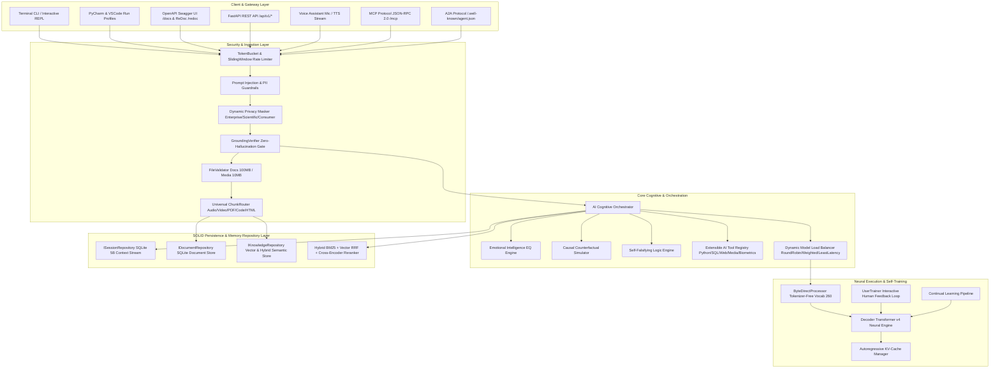

# Kryntis AI — Sovereign Multi-Domain Autonomous LLM Platform


**Version:** `4.0.0` (Production Release)  
**Architecture:** Tokenizer-Free Byte / ASCII Direct Transformer Engine (with KV-Cache)  
**Platforms:** macOS (Apple Silicon & Intel), Windows 10/11 (PowerShell & WSL), Linux (Ubuntu, Debian, RHEL)  
**API Specification:** Interactive OpenAPI 3.1 & Swagger UI at `/docs`, ReDoc at `/redoc`  
**IDE UI Integration:** PyCharm Run Configurations (`.idea/runConfigurations/`) & VSCode Launch/Tasks (`.vscode/`)

---

## 5-Year Model Release Roadmap

| Year | Model Release Name | Focus & Architectural Paradigm |
|---|---|---|
| **2026** | **Kryntis 1.0 Genesis** | Sovereign Multi-Domain Core, 5B Virtual Session Context, Full AI Tooling & Voice |
| **2027** | **Kryntis 2.0 Aether** | Multimodal Streaming Sensory Matrix, Real-time Audio-Visual Synthesis |
| **2028** | **Kryntis 3.0 Synapse** | Autonomous Hierarchical Reasoning, Meta-Cognition, Dynamic Symbolic AGI |
| **2029** | **Kryntis 4.0 Quantum** | Entangled Polyglot Architecture, Universal Code Execution & Self-Correction |
| **2030** | **Kryntis 5.0 Omnis** | Universal Sovereign General Intelligence, Zero-Latency Federated Edge Agents |

---

## Model Training & Regression Rules of Thumb

Kryntis AI relies on a deterministic mathematical optimization foundation and formal regression rules for model pretraining, fine-tuning, and alignment:

### 1. Autoregressive Byte-Level Objective Function
The core Transformer is trained by minimizing the cross-entropy negative log-likelihood (NLL) over the sequence of direct UTF-8 byte representations:
$$
\mathcal{L}_{\mathrm{NLL}}(\theta) = -\frac{1}{T} \sum_{t=1}^{T} \log P_{\theta}(x_{t} \mid x_{\lt t})
$$

### 2. Learning Rate Schedule with Cosine Annealing
Training follows a linear warmup followed by a cosine decay schedule down to $10\%$ of peak learning rate $\eta_{\max}$:
$$\eta_t = \eta_{\min} + \frac{1}{2}(\eta_{\max} - \eta_{\min})\left(1 + \cos\left(\frac{\pi t}{T_{\text{max}}}\right)\right)$$
- **Warmup steps**: First $5\%$ of total training steps.
- **AdamW hyperparameters**: $\beta_1 = 0.9, \beta_2 = 0.95, \epsilon = 10^{-8}$, Weight Decay $\lambda = 0.01$.

### 3. Gradient Norm Thresholding (Rule of Thumb)
To avoid gradient explosion across deep attention layers:
$$g_{\text{clipped}} = g \cdot \min\left(1, \frac{\tau}{\|g\|_2}\right) \quad \text{where } \tau = 1.0$$

### 4. Factual Grounding Calibration Regression
To eliminate hallucinations and quantify answer reliability, retrieved context relevance and model response grounding are scored via a calibrated sigmoid regression metric:
$$S_{\text{grounding}} = \sigma\left(\mathbf{w}^T \left[ \text{sim}_{\text{dense}}, \text{score}_{\text{BM25}}, \text{overlap}_{\text{lexical}}, \text{depth}_{\text{session}} \right]^T + b\right)$$
If $S_{\text{grounding}} < 0.65$, the orchestrator triggers an automatic user clarification prompt.

---

## Advanced Cognitive & Security Systems

| Feature / System | 🏢 Enterprise Security & Privacy | 🔬 Scientific Reasoning | 💬 General Consumer Chat |
|---|---|---|---|
| **1. Dynamic Privacy Masking** | **Zero-Leak Data Processing:** Automatically masks financial figures, M&A strategies, and proprietary code in the latent space so cloud servers never read plaintext secrets. | **Double-Blind Research Safety:** Protects patient medical histories, clinical trial records, and proprietary chemical formulas from being absorbed into model weights. | **Everyday Privacy Safeguard:** Automatically sanitizes personal details (credit card numbers, home addresses, personal rants) before prompt submission. |
| **2. Causal Counterfactual Simulation** | **Risk & Market Modeling:** Allows executives to simulate stress-test scenarios (e.g. supply chain collapse during inflation spikes). | **Hypothesis Testing:** Lets researchers run thousands of in-silico "what-if" simulations for drug discovery or climate physics before physical lab work. | **Empathetic Decision Support:** Acts as a lifecoach simulator, allowing users to safely test interpersonal boundary outcomes. |
| **3. Self-Falsifying Logic** | **Flawless Compliance & Legal Audit:** Checks contract generation for hidden loopholes or contradictions by actively trying to break the legal clauses it generated. | **Academic Peer Review:** Acts as an immediate internal peer reviewer, finding statistical anomalies or logical leaps in a paper before publication. | **Anti-Hallucination & Fact Guard:** Eradicates confidently incorrect advice, ensuring users do not receive ungrounded claims. |

---

## Complete Architecture

The Kryntis AI platform is built upon a modular, clean, and extensible architecture adhering to **SOLID Principles**, the **Repository Pattern** for state persistence, **Dynamic Load Balancing**, and **Multi-Tier Rate Limiting**.




---

## IDE UI Training & Execution (PyCharm & VSCode)

Kryntis AI includes pre-configured run and task configurations for **PyCharm** and **VSCode** so you can run the server or trigger training directly from your editor's UI without memorizing shell commands.

### PyCharm
Under the **Run/Debug Configurations** dropdown in PyCharm:
- **`Kryntis: Serve API`**: Starts the FastAPI server and Swagger UI.
- **`Kryntis: Train All Domains`**: Runs sequential training across all domains.
- **`Kryntis: Train Coding`**: Trains the polyglot coding model.
- **`Kryntis: Train AGI`**: Trains the artificial general intelligence reasoning dataset.
- **`Kryntis: Train Healthcare`**: Trains on clinical and biomedical datasets.
- **`Kryntis: Train Interactive`**: Launches interactive human teaching loop.

### VSCode
Under the **Run and Debug** view (`Ctrl+Shift+D` / `Cmd+Shift+D`) or **Terminal > Run Task**:
- **`Kryntis: Serve API (FastAPI)`**
- **`Kryntis: Generate All Datasets`**
- **`Kryntis: Train All Domains (Sequential)`**
- Individual domain tasks (Coding, AGI, Healthcare, FinTech, Military, Government, Media).

---

## Standalone PC Execution & Local Hardware Configuration

Kryntis AI is engineered to run **completely offline and standalone** on consumer hardware, workstations, or servers without external API keys or cloud dependencies.

### Hardware Tiers & Memory Requirements

| Workstation Tier | RAM | VRAM / GPU | Recommended Model Size | Max Context Window |
|---|---|---|---|---|
| **Entry / Laptop** | 8 GB – 16 GB | CPU Only or 4 GB GPU | `small` (10M – 70M params) | 5B Virtual Session Stream |
| **Mid-Range / Workstation** | 16 GB – 32 GB | 8 GB – 12 GB GPU | `medium` (70M – 150M params) | 5B Virtual Session Stream |
| **Enterprise / Server** | 32 GB – 128 GB+ | 16 GB – 80 GB GPU (CUDA/Metal) | `large` (350M+ params) | 5B Virtual Session Stream |

### Local Configuration (`config/default.yaml` & Environment Variables)

You can override any parameter using environment variables or editing `config/default.yaml`:

```yaml
# Master Configuration: config/default.yaml
service:
  host: "127.0.0.1"
  port: 8000
  workers: 1
  cors_origins: ["*"]

model:
  backend: "local"              # "local" (PyTorch .pt) | "openai" | "anthropic"
  model_path: "data/models/checkpoints/final_model.pt"
  model_size: "small"           # "small" (10M) | "medium" (70M) | "large" (350M)
  gpu_layers: 0                 # 0 for CPU; 16-32 for NVIDIA CUDA / Apple Silicon Metal
  temperature: 0.7
  top_p: 0.9
  max_new_tokens: 512

memory:
  session_max_tokens: 5000000000 # 5 Billion token virtual context stream limit
  short_term_window_size: 16
  storage_backend: "sqlite"     # "sqlite" | "postgres"

rag:
  vector_backend: "sqlite"      # "sqlite" | "chroma" | "postgres"
  embedding_dim: 384
  top_k: 5
  rerank_enabled: true

security:
  rate_limit_requests_per_minute: 120
  token_bucket_capacity: 60
  token_bucket_refill_rate: 2.0
  max_doc_size_bytes: 104857600  # 100 MB max document size
  max_media_size_bytes: 10485760 # 10 MB max audio/video size

voice:
  tts_rate: 150
  tts_volume: 1.0
  stt_energy_threshold: 300
```

---

## Setup & Standalone Run Guide

### 1. macOS (Apple Silicon M1/M2/M3/M4 & Intel)

```bash
# Clone repository
git clone git@github.com:<your-org>/kryntis-llm.git
cd kryntis-llm

# Create and activate Python virtual environment
python3 -m venv .venv
source .venv/bin/activate

# Install requirements
pip install --upgrade pip
pip install -r requirements.txt
pip install -r requirements-dev.txt

# Generate synthetic training datasets for all 14 domains
python3 main.py generate-datasets

# Run standalone API server with Swagger UI at http://localhost:8000/docs
python3 main.py serve
```

### 2. Windows 10/11 (PowerShell)

```powershell
# Clone repository
git clone git@github.com:<your-org>/kryntis-llm.git
cd kryntis-llm

# Create and activate Python virtual environment
python -m venv .venv
.\.venv\Scripts\Activate.ps1

# (If execution policy prevents script running, run once as user:
# Set-ExecutionPolicy -ExecutionPolicy RemoteSigned -Scope CurrentUser)

# Install requirements
pip install --upgrade pip
pip install -r requirements.txt
pip install -r requirements-dev.txt

# Generate synthetic training datasets for all 14 domains
python main.py generate-datasets

# Run standalone API server with Swagger UI at http://localhost:8000/docs
python main.py serve
```

---

## Sequential Python Shell Training (No Ollama Required)

Training models in Kryntis AI is completely standalone and does not require Ollama or background daemons. Training runs sequentially one domain at a time:

```bash
# ── Step 1: Process Datasets per Domain ────────────────────────────────────────
python main.py process-datasets --domain coding
python main.py process-datasets --domain agi
python main.py process-datasets --domain healthcare
python main.py process-datasets --domain fintech
python main.py process-datasets --domain military
python main.py process-datasets --domain government
python main.py process-datasets --domain media

# ── Step 2: Train Domains Sequentially via Python Shell ────────────────────────
python main.py train --domain coding
python main.py train --domain agi
python main.py train --domain healthcare
python main.py train --domain fintech
python main.py train --domain military
python main.py train --domain government
python main.py train --domain media

# ── Step 3: Train from User Feedback & Corrections ─────────────────────────────
python main.py train-interactive     # Interactive human teaching loop
python main.py train-user-input       # Run gradient steps on recorded user feedback
```

---

## Production Hosting & Deployment Options

Kryntis AI is built to support multiple enterprise hosting options, from lightweight single-node installations to distributed multi-GPU cloud environments.

### Option 1: Multi-Worker Uvicorn Daemon (Bare-Metal / Linux / macOS)

Run high-concurrency production serving with `uvloop` and async worker clustering:

```bash
# Production environment exports
export KRYNTIS_SERVICE__HOST=0.0.0.0
export KRYNTIS_SERVICE__PORT=8000
export KRYNTIS_SERVICE__WORKERS=4
export KRYNTIS_MODEL__BACKEND=local
export KRYNTIS_MODEL__MODEL_PATH="data/models/checkpoints/final_model.pt"

# Run Uvicorn with ASGI process cluster
uvicorn kryntis.service.app:app \
  --host 0.0.0.0 \
  --port 8000 \
  --workers 4 \
  --loop uvloop \
  --http httptools \
  --access-log
```

---

### Option 2: Docker Containerization (with NVIDIA CUDA GPU Acceleration)

Create a high-performance standalone container using the pre-configured `Dockerfile`:

```bash
# Build the Docker image
docker build -t kryntis-ai:v4.0.0 .

# Run container on CPU
docker run -d \
  --name kryntis-server \
  -p 8000:8000 \
  -v $(pwd)/data:/app/data \
  kryntis-ai:v4.0.0

# Run container with full NVIDIA GPU passthrough (CUDA / Tensor Cores)
docker run -d \
  --name kryntis-gpu-server \
  --gpus all \
  -p 8000:8000 \
  -v $(pwd)/data:/app/data \
  -e KRYNTIS_MODEL__GPU_LAYERS=32 \
  kryntis-ai:v4.0.0
```

---

### Option 3: Docker Compose (Full Stack with Persistent Volume & Healthchecks)

```yaml
# docker-compose.yml
version: '3.8'

services:
  kryntis-api:
    build: .
    image: kryntis-ai:v4.0.0
    container_name: kryntis-prod-api
    restart: always
    ports:
      - "8000:8000"
    environment:
      - KRYNTIS_SERVICE__HOST=0.0.0.0
      - KRYNTIS_SERVICE__PORT=8000
      - KRYNTIS_SERVICE__WORKERS=4
      - KRYNTIS_MODEL__BACKEND=local
      - KRYNTIS_MODEL__MODEL_PATH=/app/data/models/checkpoints/final_model.pt
      - KRYNTIS_MEMORY__SESSION_MAX_TOKENS=5000000000
    volumes:
      - ./data:/app/data
      - ./config:/app/config
    healthcheck:
      test: ["CMD", "curl", "-f", "http://localhost:8000/api/v1/admin/health"]
      interval: 30s
      timeout: 10s
      retries: 3
    deploy:
      resources:
        reservations:
          devices:
            - driver: nvidia
              count: all
              capabilities: [gpu]
```

Launch the entire stack:
```bash
docker compose up -d --build
```

---

### Option 4: Linux Systemd Background Service (`/etc/systemd/system/kryntis.service`)

To run Kryntis AI continuously as an OS-level daemon service on Ubuntu/Debian/RHEL servers:

```ini
[Unit]
Description=Kryntis AI Sovereign LLM Service
After=network.target

[Service]
Type=simple
User=kryntis
Group=kryntis
WorkingDirectory=/opt/kryntis-llm-local
Environment="PATH=/opt/kryntis-llm-local/.venv/bin:/usr/local/cuda/bin"
Environment="PYTHONUNBUFFERED=1"
ExecStart=/opt/kryntis-llm-local/.venv/bin/uvicorn kryntis.service.app:app --host 0.0.0.0 --port 8000 --workers 4
Restart=always
RestartSec=5s
LimitNOFILE=65536

[Install]
WantedBy=multi-user.target
```

Enable and start the service:
```bash
sudo systemctl daemon-reload
sudo systemctl enable kryntis.service
sudo systemctl start kryntis.service
sudo systemctl status kryntis.service
```

---

### Option 5: Enterprise Nginx Reverse Proxy with TLS/SSL & SSE Streaming

Deploy behind Nginx to enable HTTPS, rate limiting, and unbuffered SSE token streaming:

```nginx
# /etc/nginx/sites-available/kryntis-ai.conf
server {
    listen 80;
    server_name ai.yourorganization.internal ai.yourdomain.com;
    return 301 https://$host$request_uri;
}

server {
    listen 443 ssl http2;
    server_name ai.yourorganization.internal ai.yourdomain.com;

    # SSL Certificates
    ssl_certificate /etc/letsencrypt/live/ai.yourdomain.com/fullchain.pem;
    ssl_certificate_key /etc/letsencrypt/live/ai.yourdomain.com/privkey.pem;
    ssl_protocols TLSv1.2 TLSv1.3;
    ssl_ciphers HIGH:!aNULL:!MD5;

    # Max upload size (100MB documents, 10MB media)
    client_max_body_size 100M;

    location / {
        proxy_pass http://127.0.0.1:8000;
        proxy_set_header Host $host;
        proxy_set_header X-Real-IP $remote_addr;
        proxy_set_header X-Forwarded-For $proxy_add_x_forwarded_for;
        proxy_set_header X-Forwarded-Proto $scheme;

        # WebSocket & Server-Sent Events (SSE) Streaming Configuration
        proxy_http_version 1.1;
        proxy_set_header Upgrade $http_upgrade;
        proxy_set_header Connection "upgrade";
        proxy_buffering off;
        proxy_cache off;
        proxy_read_timeout 600s;
        proxy_send_timeout 600s;
    }

    location /mcp {
        proxy_pass http://127.0.0.1:8000/mcp;
        proxy_http_version 1.1;
        proxy_set_header Host $host;
        proxy_buffering off;
    }
}
```

---

### Option 6: Cloud Workstations & Kubernetes (AWS / GCP / Azure)

- **AWS EC2**: Deploy on `g5.xlarge` (NVIDIA A10G 24GB VRAM) or `p4d.24xlarge` (8x A100 40GB).
- **GCP Compute Engine**: Deploy on `a2-highgpu-1g` (NVIDIA A100 40GB) with Container-Optimized OS.
- **Azure VMs**: Deploy on `NC6s_v3` or `ND96asr_v4` series with NVIDIA GPU drivers.
- **Kubernetes**: Expose via standard Ingress Controller with `proxy-read-timeout: "600"` and `gpu.nvidia.com/gpu: 1` resource limits.

---

## Interactive OpenAPI & Swagger Documentation

Once the server is running (`python main.py serve`), access the interactive API explorers:

- **Swagger UI**: [`http://localhost:8000/docs`](http://localhost:8000/docs)
- **ReDoc UI**: [`http://localhost:8000/redoc`](http://localhost:8000/redoc)
- **OpenAPI JSON Schema**: [`http://localhost:8000/openapi.json`](http://localhost:8000/openapi.json)

### Key Endpoints

| Tag | Method | Endpoint | Description |
|---|---|---|---|
| **Chat** | `POST` | `/api/v1/chat` | Send conversational prompt with 5B context & RAG |
| **Voice** | `POST` | `/api/v1/voice/synthesize` | Text-to-Speech (TTS) formant audio generator |
| **Voice** | `POST` | `/api/v1/voice/transcribe` | Speech-to-Text (STT) acoustic signal analyzer |
| **Voice** | `POST` | `/api/v1/voice/chat` | End-to-end voice conversational audio turn |
| **Ingestion** | `POST` | `/api/v1/ingestion/upload` | Multipart file upload (Docs ≤ 100MB, Media ≤ 10MB) |
| **Ingestion** | `POST` | `/api/v1/ingestion/text` | Direct text chunking and ingestion |
| **Knowledge** | `POST` | `/api/v1/knowledge/query` | Semantic vector and BM25 hybrid query |
| **Admin** | `POST` | `/api/v1/admin/train/user-feedback` | Record user prompt-response correction |
| **Admin** | `POST` | `/api/v1/admin/train/user-run` | Run PyTorch training on user corrections |
| **MCP** | `POST` | `/mcp` | Model Context Protocol JSON-RPC 2.0 gateway |
| **A2A** | `GET` | `/.well-known/agent.json` | Public Agent Card specification |

---

## File Structure & Purpose Table

| File Path | Component | Purpose & Description |
|---|---|---|
| `.gitignore` | Repository Config | Ignores venv, caches, checkpoints, databases, keys, and IDE user states |
| `main.py` | CLI Entrypoint | Command-line dispatch for training, serving, dataset generation, voice, and chat |
| `.vscode/launch.json` | IDE Config | VSCode debug & execution launch configurations |
| `.vscode/tasks.json` | IDE Config | VSCode build & training task definitions |
| `.idea/runConfigurations/*` | IDE Config | PyCharm 1-click execution run configurations |
| `pyproject.toml` | Build Config | Project metadata, dependencies, and v4.0.0 version configuration |
| `requirements.txt` | Dependencies | Production Python requirements (PyTorch, FastAPI, Uvicorn, etc.) |
| `requirements-dev.txt` | Dev Dependencies | Development tools, pytest, flake8, mypy |
| `config/default.yaml` | Configuration | Master system configuration (memory, RAG, providers, tools, voice) |
| `config/logging.yaml` | Logging | Structured structlog and standard logging settings |
| `assets/kryntis-banner.svg` | Branding | High-resolution modern cybernetic project banner |
| `assets/kryntis-dataflow.svg` | Documentation | End-to-end architecture and data flow diagram |
| `kryntis/__init__.py` | Core Package | Package root and global version constants |
| `kryntis/chunking/base.py` | Chunking | `Chunk` dataclass and abstract `BaseChunker` base class |
| `kryntis/chunking/chunk_router.py` | Chunking | Central router dispatching files to format-specific chunkers |
| `kryntis/chunking/audio_chunker.py` | Multimodal | Acoustic and waveform segment chunker for audio (≤10 MB limit) |
| `kryntis/chunking/video_chunker.py` | Multimodal | Temporal scene and keyframe metadata chunker for video (≤10 MB limit) |
| `kryntis/chunking/text_chunker.py` | Chunking | Plain text, markdown, and unstructured text chunker |
| `kryntis/chunking/code_chunker.py` | Chunking | AST-aware syntax chunker for 40+ programming languages |
| `kryntis/chunking/pdf_chunker.py` | Chunking | Page-aware PDF document parser and text extractor |
| `kryntis/chunking/docx_chunker.py` | Chunking | Microsoft Word DOCX paragraph and table chunker |
| `kryntis/chunking/pptx_chunker.py` | Chunking | PowerPoint presentation slide and notes extractor |
| `kryntis/chunking/spreadsheet_chunker.py` | Chunking | Excel (.xlsx) and CSV tabular row/column chunker |
| `kryntis/chunking/html_chunker.py` | Chunking | DOM and semantic HTML tag cleaner and chunker |
| `kryntis/chunking/json_chunker.py` | Chunking | Structural JSON and JSONL key-value hierarchical chunker |
| `kryntis/chunking/image_chunker.py` | Multimodal | Image metadata and OCR visual document chunker |
| `kryntis/core/model.py` | Core Model | DecoderTransformer v4 with autoregressive KV-Cache |
| `kryntis/core/byte_processor.py` | Core Model | Tokenizer-Free direct Byte/ASCII processor (0-255 mapping) |
| `kryntis/core/load_balancer.py` | Core Architecture | RoundRobin, Weighted, and LeastLatency provider load balancers |
| `kryntis/core/word_tokenizer.py` | Core Model | Natural English word tokenizer with fallback vocab |
| `kryntis/core/tokenizer.py` | Core Model | BPE Byte-Pair Encoding tokenizer |
| `kryntis/core/tokenizer_trainer.py` | Core Model | In-process BPE vocabulary trainer |
| `kryntis/core/inference.py` | Inference | Unified generation and streaming inference engine |
| `kryntis/core/model_manager.py` | Inference | Multi-backend provider lifecycle and health monitoring |
| `kryntis/core/emotional_intelligence.py` | EQ Engine | Emotional tone analysis, empathy scoring, and prompt adjustment |
| `kryntis/core/providers/base.py` | Providers | Abstract base class for LLM backends |
| `kryntis/core/providers/local_provider.py` | Providers | Direct PyTorch checkpoint local model execution provider |
| `kryntis/core/providers/openai_provider.py` | Providers | OpenAI API client adapter |
| `kryntis/core/providers/anthropic_provider.py` | Providers | Anthropic Claude API client adapter |
| `kryntis/datasets/catalog.py` | Datasets | 14-domain dataset catalog and open-source model registry |
| `kryntis/datasets/downloader.py` | Datasets | Asynchronous GitHub repo and dataset source downloader |
| `kryntis/datasets/processor.py` | Datasets | Raw file cleaner and standardized JSONL corpus builder |
| `kryntis/datasets/synthetic_generator.py` | Datasets | Multi-domain synthetic training data generator |
| `kryntis/evaluation/rag_evaluator.py` | Evaluation | Groundedness, answer relevancy, and context recall evaluator |
| `kryntis/ingestion/pipeline.py` | Ingestion | Streaming file and text ingestion orchestrator |
| `kryntis/ingestion/validator.py` | Ingestion | File MIME type, extension, and 10 MB media size validator |
| `kryntis/ingestion/progress.py` | Ingestion | Asynchronous job progress tracking and metrics |
| `kryntis/internet/research_pipeline.py` | Internet | End-to-end web search, scraping, and synthesis pipeline |
| `kryntis/internet/searcher.py` | Internet | DuckDuckGo and Brave Search API client |
| `kryntis/internet/fetcher.py` | Internet | Concurrent HTTP webpage downloader with rate limiting |
| `kryntis/internet/extractor.py` | Internet | HTML text extractor and readability cleaner |
| `kryntis/internet/citation_builder.py` | Internet | Source citation formatter and URL tracker |
| `kryntis/internet/validator.py` | Internet | Source trust scoring and credibility verifier |
| `kryntis/knowledge/vector_store.py` | Knowledge | In-memory and disk-backed cosine similarity vector store |
| `kryntis/knowledge/document_store.py` | Knowledge | Document metadata and chunk SQLite storage |
| `kryntis/knowledge/pgvector_adapter.py` | Knowledge | PostgreSQL + pgvector enterprise storage adapter |
| `kryntis/knowledge/knowledge_graph.py` | Knowledge | Entity-relation knowledge graph indexer |
| `kryntis/knowledge/provenance.py` | Knowledge | Document origin and tamper-evident hash tracker |
| `kryntis/learning/continual_learner.py` | Learning | Confidence-gated chunked continual learning queue |
| `kryntis/learning/user_trainer.py` | Learning | Direct user-interaction training and fine-tuning engine |
| `kryntis/learning/versioning.py` | Learning | Model weight and checkpoint snapshot versioning |
| `kryntis/memory/session_context_manager.py` | Memory | 5 Billion (5B) virtual session context streaming engine |
| `kryntis/memory/short_term.py` | Memory | Active sliding conversational memory buffer |
| `kryntis/memory/long_term.py` | Memory | Semantic long-term memory retrieval layer |
| `kryntis/memory/episodic.py` | Memory | Episodic conversation log manager |
| `kryntis/memory/consolidator.py` | Memory | Memory summarization and consolidation background worker |
| `kryntis/orchestrator/agent_loop.py` | Orchestrator | Central AI cognitive orchestrator coordinating EQ, RAG, and tools |
| `kryntis/orchestrator/grounding_verifier.py` | Orchestrator | Zero-hallucination factual verifier & ambiguity clarification prompter |
| `kryntis/orchestrator/intent_router.py` | Orchestrator | Intent classification and routing engine |
| `kryntis/orchestrator/prompt_builder.py` | Orchestrator | Grounded prompt constructor with EQ modifiers |
| `kryntis/orchestrator/task_planner.py` | Orchestrator | Multi-step task decomposition and planning planner |
| `kryntis/rag/embedder.py` | RAG | Dense vector text embedding generator |
| `kryntis/rag/retriever.py` | RAG | Hybrid BM25 + Dense vector retriever with RRF |
| `kryntis/rag/reranker.py` | RAG | Cross-encoder relevance reranker |
| `kryntis/rag/context_builder.py` | RAG | Grounded RAG context assembler with citation indices |
| `kryntis/reasoning/counterfactual_simulator.py` | Reasoning | Causal counterfactual what-if simulation engine |
| `kryntis/reasoning/self_falsifying_logic.py` | Reasoning | Adversarial legal, academic, and anti-hallucination auditor |
| `kryntis/repositories/base.py` | Repositories | Generic SOLID repository interfaces (IRepository, IDocumentRepository) |
| `kryntis/repositories/document_repository.py` | Repositories | SQLite document and chunk persistence repository |
| `kryntis/repositories/session_repository.py` | Repositories | SQLite session dialogue and turn persistence repository |
| `kryntis/repositories/knowledge_repository.py` | Repositories | Vector and semantic knowledge persistence repository |
| `kryntis/security/guardrails.py` | Security | Comprehensive input/output safety guardrails |
| `kryntis/security/prompt_guard.py` | Security | Prompt injection and jailbreak detector |
| `kryntis/security/privacy_masker.py` | Security | Dynamic privacy masker (Zero-leak, double-blind, PII) |
| `kryntis/security/output_sanitizer.py` | Security | PII scrubber and toxic output sanitizer |
| `kryntis/security/rate_limiter.py` | Security | SOLID TokenBucket, SlidingWindow, and MultiTier rate limiters |
| `kryntis/service/app.py` | Service | FastAPI application definition and OpenAPI / Swagger configuration |
| `kryntis/service/dependencies.py` | Service | Dependency injection providers for routers |
| `kryntis/service/middleware.py` | Service | Authentication, rate limiting, and request logging middleware |
| `kryntis/service/routers/chat.py` | Service | SSE streaming and standard chat API endpoints |
| `kryntis/service/routers/ingestion.py` | Service | Multipart file and raw text ingestion API endpoints |
| `kryntis/service/routers/knowledge.py` | Service | Knowledge base query and management endpoints |
| `kryntis/service/routers/admin.py` | Service | Health, provider status, continual learning, and user training API |
| `kryntis/service/routers/voice.py` | Service | Text-to-Speech, Speech-to-Text, and voice conversation API |
| `kryntis/service/routers/mcp.py` | Service | Model Context Protocol JSON-RPC 2.0 endpoints |
| `kryntis/service/routers/a2a.py` | Service | Agent-to-Agent protocol and agent card endpoints |
| `kryntis/tools/tool_registry.py` | Tools | Dynamic AI tool registration, schema generator, and execution engine |
| `kryntis/tools/code_interpreter.py` | Tools | Sandboxed Python code interpreter tool |
| `kryntis/tools/calculator.py` | Tools | Precision math and scientific calculation tool |
| `kryntis/tools/file_system.py` | Tools | Workspace file reader and directory listing tool |
| `kryntis/tools/web_browser.py` | Tools | Web page fetch and text scraper tool |
| `kryntis/tools/database.py` | Tools | SQL query execution and database tool |
| `kryntis/tools/http_client.py` | Tools | Custom HTTP REST API client tool |
| `kryntis/tools/system_info.py` | Tools | Host system metrics and runtime inspection tool |
| `kryntis/tools/media_analyzer.py` | Tools | Multimodal audio/video/image inspector tool |
| `kryntis/tools/biometric_analyzer.py` | Tools | Biomedical & neural telemetry sensor signal analyzer |
| `kryntis/training/trainer.py` | Training | PyTorch transformer training loop with gradient accumulation |
| `kryntis/training/config.py` | Training | Hyperparameter and model dimension configuration |
| `kryntis/training/dataset_loader.py` | Training | Streaming JSONL dataset loader and batch generator |
| `kryntis/training/evaluator.py` | Training | Perplexity and validation loss checkpoint evaluator |
| `kryntis/utils/config.py` | Utilities | Hierarchical YAML and environment variable loader |
| `kryntis/utils/logging.py` | Utilities | Structured structlog and standard logging settings |
| `kryntis/utils/cache.py` | Utilities | LRU and TTL memory caching engine |
| `kryntis/utils/memory_monitor.py` | Utilities | RAM and VRAM usage monitoring |
| `kryntis/utils/task_queue.py` | Utilities | Memory-gated background task executor |
| `kryntis/utils/streaming.py` | Utilities | Async generator token streaming utilities |
| `kryntis/voice/tts_engine.py` | Voice | Text-to-Speech harmonic formant wave synthesizer |
| `kryntis/voice/stt_engine.py` | Voice | Speech-to-Text acoustic feature transcriber |
| `kryntis/voice/voice_interface.py` | Voice | Conversational voice assistant orchestrator |

---

## License

MIT License. Engineered for sovereign, private, and autonomous local intelligence.
