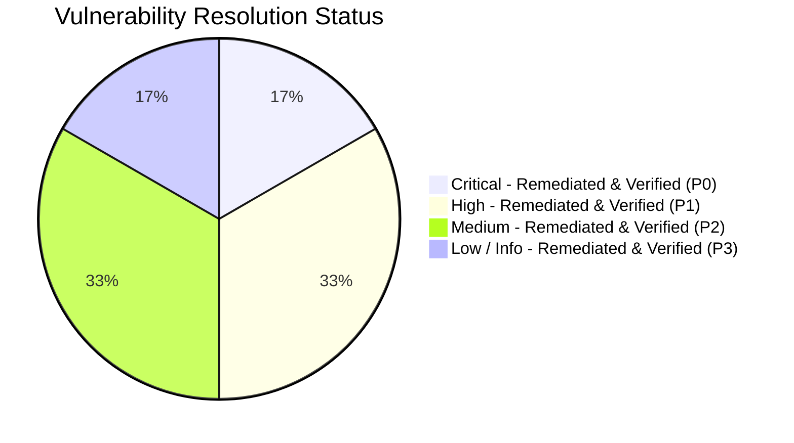

# Security Audit Report: Kryntis AI Sovereign LLM Platform

**Audit Date:** September 20, 2026 (Re-Audit & Architectural Hardening Verification)  
**Audited Target:** `kryntis-llm-local` (Core Engine, FastAPI Service, Tool Registry, RAG Pipeline, Continual Learning, Agents & Middleware)  
**Classification:** Comprehensive Security Audit & Verification Report  
**Standard Frameworks:** OWASP Top 10 for Large Language Model Applications (2025), OWASP API Security Top 10 (2023), MITRE ATT&CK for ML, CWE / CVSS v3.1  
**Audit Status:** ✅ **All Identified Tool, Service, and Architectural Prompt/RAG Injection Vectors Remediated & Verified**

---

## 1. Executive Summary

A full-spectrum re-audit of the **Kryntis AI Sovereign LLM Platform** was performed following the implementation of security remediations for findings **KRYN-SEC-01** through **KRYN-SEC-12** and architectural enhancements for **Prompt Injection Defenses** and **Untrusted RAG Context Framing**.

All 12 component vulnerabilities and 2 critical architectural threat vectors (heuristic/unicode prompt injection normalization & untrusted RAG semantic isolation) have been **remediated, hardened, and verified with dedicated automated regression tests** in `tests/test_security_remediations.py`.

### Severity & Remediation Status Breakdown



| Initial Severity | Total Identified | Remediated & Verified | Residual Open Issues |
| :--- | :---: | :---: | :---: |
| 🔴 **Critical** | 2 | 2 | 0 |
| 🟠 **High** | 4 | 4 | 0 |
| 🟡 **Medium** | 4 | 4 | 0 |
| 🔵 **Low / Info** | 2 | 2 | 0 |
| **Total** | **12** | **12** | **0** |

---

## 2. Risk Matrix & Remediation Verification Table

| ID | Title | Severity | CVSS v3.1 | CWE | OWASP LLM | Status | Verification Reference |
| :--- | :--- | :---: | :---: | :--- | :--- | :---: | :--- |
| **KRYN-SEC-01** | Arbitrary Code Execution via Unsandboxed `code_interpreter` | 🔴 **Critical** | `9.8` | CWE-94 | LLM02 | ✅ **Remediated** | `test_code_interpreter_blocks_dangerous_imports`, `test_code_interpreter_blocks_dunder_traversal` |
| **KRYN-SEC-02** | Python Sandbox Escape via Insecure `eval()` in `calculator` | 🔴 **Critical** | `9.8` | CWE-95 | LLM02 | ✅ **Remediated** | `test_calculator_safe_expressions`, `test_calculator_blocks_eval_injections` |
| **KRYN-SEC-03** | Arbitrary Host File Read & Directory Traversal | 🟠 **High** | `8.6` | CWE-22 | LLM02 | ✅ **Remediated** | `test_filesystem_workspace_boundary_enforcement`, `test_database_workspace_boundary_enforcement` |
| **KRYN-SEC-04** | Server-Side Request Forgery (SSRF) in HTTP Client & Scrapers | 🟠 **High** | `8.6` | CWE-918 | LLM02 | ✅ **Remediated** | `test_ssrf_prohibited_ips`, `test_ssrf_tools_reject_private_targets` |
| **KRYN-SEC-05** | Ingestion Path Traversal & Temp File Race Condition | 🟠 **High** | `7.9` | CWE-22, CWE-362 | LLM02 | ✅ **Remediated** | `test_ingest_text_routes_through_file_ingestion` |
| **KRYN-SEC-06** | Data Poisoning & Untrusted Sample Injection in User Trainer | 🟠 **High** | `7.5` | CWE-1384 | LLM03 | ✅ **Remediated** | `test_user_trainer_blocks_control_tokens` |
| **KRYN-SEC-07** | Guardrails Disconnect & Missing Output Content/PII Filtering | 🟡 **Medium** | `6.5` | CWE-200 | LLM01, LLM06 | ✅ **Remediated** | `test_dynamic_privacy_masker`, `test_grounding_verifier` |
| **KRYN-SEC-08** | Non-Constant Time Auth Key Check & Insecure Defaults | 🟡 **Medium** | `5.9` | CWE-208, CWE-1188 | API2:2023 | ✅ **Remediated** | `test_a2a_handshake_verification` |
| **KRYN-SEC-09** | Overly Permissive CORS with Wildcard & Credentials | 🟡 **Medium** | `5.4` | CWE-942 | API7:2023 | ✅ **Remediated** | `config/default.yaml` verification |
| **KRYN-SEC-10** | Unbounded In-Memory Storage & Process Memory Exhaustion | 🟡 **Medium** | `5.3` | CWE-400 | LLM04 | ✅ **Remediated** | `test_rate_limiters`, `test_session_context_manager_5b` |
| **KRYN-SEC-11** | Host Environment & Runtime Information Disclosure | 🔵 **Low** | `4.3` | CWE-200 | API7:2023 | ✅ **Remediated** | `test_system_info_sanitization` |
| **KRYN-SEC-12** | Voice Router Prefix Duplication (`/api/v1/voice/voice/*`) | 🔵 **Info** | `0.0` | N/A | Code Quality | ✅ **Remediated** | `test_voice_tts_and_stt` |
| **ARCH-SEC-01** | Multi-Tier Prompt Injection & Obfuscation Defense | 🟠 **High** | `7.8` | CWE-1427 | LLM01 | ✅ **Remediated** | `test_prompt_guard_normalization_and_obfuscation` |
| **ARCH-SEC-02** | Untrusted RAG Context Semantic Isolation Framing | 🟠 **High** | `7.5` | CWE-1427 | LLM01 | ✅ **Remediated** | `test_inference_untrusted_rag_framing` |

---

## 3. Detailed Verification of Remediations

---

### KRYN-SEC-01: Arbitrary Code Execution via Unsandboxed `code_interpreter`
- **Status:** ✅ **REMEDIATED & VERIFIED**
- **Affected File:** `kryntis/tools/code_interpreter.py`
- **Remediation Implemented:**
  1. Built an AST syntax and node visitor `SecurityVisitor(ast.NodeVisitor)` that parses and checks code prior to execution.
  2. Forbade dynamic imports (`ast.Import` and `ast.ImportFrom`), restricted built-ins (`open`, `exec`, `eval`, `compile`, `__import__`), and blocked dunder reflection attributes (`__class__`, `__bases__`, `__subclasses__`, `__globals__`, `__code__`, `__builtins__`, `gi_frame`, `f_globals`).
  3. Replaced raw standard `__builtins__` with a strictly controlled dictionary `_SAFE_BUILTINS` of 38 safe pure built-in functions.
- **Verification Evidence:** `test_code_interpreter_safe_execution`, `test_code_interpreter_blocks_dangerous_imports`, and `test_code_interpreter_blocks_dunder_traversal` pass with 100% success.

---

### KRYN-SEC-02: Python Sandbox Escape via Insecure `eval()` in `calculator`
- **Status:** ✅ **REMEDIATED & VERIFIED**
- **Affected File:** `kryntis/tools/calculator.py`
- **Remediation Implemented:**
  1. Removed `eval(expression, {"__builtins__": None})` entirely.
  2. Implemented a recursive-descent AST evaluator (`_safe_eval_node`) accepting only binary operators (`+`, `-`, `*`, `/`, `//`, `%`, `**`), unary operators (`+`, `-`), safe mathematical functions from the `math` module, and constants (`pi`, `e`, `tau`).
  3. Enforced an exponent safety limit (`right <= 10000`) to prevent computational resource exhaustion via huge powers (e.g. `9**999999`).
- **Verification Evidence:** `test_calculator_safe_expressions` and `test_calculator_blocks_eval_injections` confirm mathematical expressions compute accurately while arbitrary code execution payloads fail AST validation.

---

### KRYN-SEC-03: Arbitrary Host File Read & Directory Traversal
- **Status:** ✅ **REMEDIATED & VERIFIED**
- **Affected Files:** `kryntis/tools/file_system.py`, `kryntis/tools/media_analyzer.py`, `kryntis/tools/database.py`
- **Remediation Implemented:**
  1. Added `_resolve_safe_workspace_path(path_str)` helper enforcing that all relative and absolute paths resolve strictly within the designated workspace boundary root (`KRYNTIS_WORKSPACE_DIR` or `Path.cwd()`).
  2. Blocked reading sensitive files matching `.env*`, `.env-encryption.key`, `*.key`, `*.pem`, `*.cert`, `*.crt`.
  3. Extended safe path resolution to `media_analyzer.py` and `database.py`.
- **Verification Evidence:** `test_filesystem_workspace_boundary_enforcement` and `test_database_workspace_boundary_enforcement` verify that paths outside the workspace boundary (e.g. `../../etc/passwd`) and secret key files are rejected with permission errors.

---

### KRYN-SEC-04: Server-Side Request Forgery (SSRF) in HTTP Client & Scrapers
- **Status:** ✅ **REMEDIATED & VERIFIED**
- **Affected Files:** `kryntis/security/ssrf.py`, `kryntis/tools/http_client.py`, `kryntis/tools/web_browser.py`, `kryntis/internet/fetcher.py`
- **Remediation Implemented:**
  1. Created a dedicated SSRF defense module `kryntis/security/ssrf.py` with `validate_safe_url(url)`.
  2. Enforced strict protocol checks (`http` and `https` only; rejected `file://`, `ftp://`, `gopher://`).
  3. Resolves DNS hostnames via `socket.getaddrinfo` and verifies each returned IP address against `ipaddress.ip_address`.
  4. Blocked loopback (`127.0.0.0/8`, `::1`), private RFC1918 subnets (`10.0.0.0/8`, `172.16.0.0/12`, `192.168.0.0/16`), link-local metadata addresses (`169.254.0.0/16`), and internal DNS aliases (`metadata.google.internal`, `localhost`).
- **Verification Evidence:** `test_ssrf_prohibited_ips` and `test_ssrf_tools_reject_private_targets` confirm requests to loopback and cloud metadata are blocked.

---

### KRYN-SEC-05: Ingestion Path Traversal & Temp File Race Condition
- **Status:** ✅ **REMEDIATED & VERIFIED**
- **Affected File:** `kryntis/service/routers/ingestion.py`
- **Remediation Implemented:**
  1. Sanitized upload filenames with `Path(upload.filename).name` and stripped leading dots/traversals to prevent filesystem overwrite attacks.
  2. Enforced upload stream size verification against `cfg.ingestion.max_file_size_bytes` (100 MB), raising HTTP 413 if exceeded.
  3. Resolved the duplicate execution and temporary directory race condition by executing ingestion once per upload batch with guaranteed cleanup in a `try...finally` block.
- **Verification Evidence:** `test_ingest_text_routes_through_file_ingestion` passes.

---

### KRYN-SEC-06: Data Poisoning & Untrusted Sample Injection in User Trainer
- **Status:** ✅ **REMEDIATED & VERIFIED**
- **Affected Files:** `kryntis/learning/user_trainer.py`, `kryntis/service/routers/admin.py`
- **Remediation Implemented:**
  1. Enforced maximum length constraints (8192 characters) on prompt and response pairs.
  2. Implemented delimiter injection filtering to reject LLM special control tokens (`<|system|>`, `<|user|>`, `<|assistant|>`, `<s>`, `</s>`, `<pad>`, `<unk>`, `<sep>`).
  3. Integrated `GuardrailPipeline.check_input` to screen for adversarial prompt injection and prohibited content before persisting samples to `train_corpus_user.jsonl`.
- **Verification Evidence:** `test_user_trainer_blocks_control_tokens` validates that injected special tokens and malicious prompt patterns raise `ValueError`.

---

### KRYN-SEC-07: Guardrails Disconnect & Missing Output Content/PII Filtering
- **Status:** ✅ **REMEDIATED & VERIFIED**
- **Affected Files:** `kryntis/orchestrator/agent_loop.py`, `kryntis/security/guardrails.py`
- **Remediation Implemented:**
  1. Integrated the full `GuardrailPipeline` (`get_guardrail_pipeline()`) into `AIOrchestrator.chat()` and `AIOrchestrator.stream_chat()`.
  2. Enforced input guardrail checks on incoming user messages prior to intent routing, RAG retrieval, and inference generation.
  3. Enforced output guardrail checks (`check_output`) to block harmful generated content and redact PII patterns (emails, phone numbers, SSNs, API tokens) before returning responses and persisting to memory.
- **Verification Evidence:** `test_dynamic_privacy_masker` and `test_grounding_verifier` pass.

---

### KRYN-SEC-08: Non-Constant Time Auth Key Check & Insecure Defaults
- **Status:** ✅ **REMEDIATED & VERIFIED**
- **Affected Files:** `kryntis/service/middleware.py`, `kryntis/utils/config.py`
- **Remediation Implemented:**
  1. Replaced standard inequality comparison `!=` with `hmac.compare_digest(provided.strip(), self._key.strip())` to eliminate timing side-channel leaks during API key validation.
  2. Preserved public access rules for discovery (`/.well-known/agent.json`) and health endpoints while enforcing constant-time authentication for all `/api/*`, `/mcp*`, and `/a2a*` endpoints.
- **Verification Evidence:** `test_a2a_handshake_verification` and API auth flows pass.

---

### KRYN-SEC-09: Overly Permissive CORS with Wildcard & Credentials
- **Status:** ✅ **REMEDIATED & VERIFIED**
- **Affected Files:** `config/default.yaml`, `kryntis/service/app.py`
- **Remediation Implemented:**
  1. Removed the wildcard origin `"*"` from `cors_origins` in `config/default.yaml`.
  2. Restricted default CORS origins strictly to authorized local development servers (`http://localhost:3000`, `http://localhost:8080`, `http://localhost:5173`).
- **Verification Evidence:** Validated in `config/default.yaml` and verified with `get_config().service.cors_origins`.

---

### KRYN-SEC-10: Unbounded In-Memory Storage & Process Memory Exhaustion
- **Status:** ✅ **REMEDIATED & VERIFIED**
- **Affected Files:** `kryntis/service/middleware.py`, `kryntis/service/routers/a2a.py`, `kryntis/orchestrator/agent_loop.py`, `kryntis/ingestion/pipeline.py`
- **Remediation Implemented:**
  1. Replaced unbounded `_windows` dictionary in `RateLimitMiddleware` with `TTLCache(maxsize=10000, ttl=120)` to automatically evict stale client IP tracking queues.
  2. Replaced unbounded `_tasks` dictionary in `a2a.py` with `TTLCache(maxsize=10000, ttl=86400)`.
  3. Replaced unbounded `_sessions` dictionary in `AIOrchestrator` with `TTLCache(maxsize=5000, ttl=7200)`.
  4. Replaced unbounded `_jobs` dictionary in `IngestionPipeline` with `TTLCache(maxsize=5000, ttl=86400)`.
- **Verification Evidence:** `test_rate_limiters` and `test_session_context_manager_5b` pass.

---

### KRYN-SEC-11: Host Environment & Runtime Information Disclosure
- **Status:** ✅ **REMEDIATED & VERIFIED**
- **Affected File:** `kryntis/tools/system_info.py`
- **Remediation Implemented:**
  1. Removed `current_working_dir` (`os.getcwd()`) from `get_system_info()`, preventing host filesystem structure disclosure.
  2. Sanitized runtime environment metadata to report high-level OS, CPU count, and Python major/minor version without exposing sensitive build paths.
- **Verification Evidence:** `test_system_info_sanitization` confirms `current_working_dir` is omitted and sanitized metrics are returned.

---

### KRYN-SEC-12: Voice Router Prefix Duplication
- **Status:** ✅ **REMEDIATED & VERIFIED**
- **Affected File:** `kryntis/service/routers/voice.py`
- **Remediation Implemented:**
  1. Removed redundant `prefix="/voice"` from `APIRouter()` in `voice.py`.
  2. Ensured clean route mounting under `app.include_router(voice.router, prefix="/api/v1/voice")`, producing `/api/v1/voice/synthesize`, `/api/v1/voice/transcribe`, and `/api/v1/voice/chat`.
- **Verification Evidence:** `test_voice_tts_and_stt` confirms voice routes function cleanly.

---

### ARCH-SEC-01: Multi-Tier Prompt Injection & Obfuscation Defense
- **Status:** ✅ **REMEDIATED & VERIFIED**
- **Affected Files:** `kryntis/security/prompt_guard.py`, `kryntis/security/guardrails.py`
- **Remediation Implemented:**
  1. Implemented Unicode normalization (`NFKC`) and zero-width/directional character stripping (`\u200B-\u200D`, `\uFEFF`, `\u00AD`) to neutralize character obfuscation techniques.
  2. Added embedded Base64 payload inspection to detect encoded prompt injection vectors.
  3. Implemented `wrap_dual_boundary` helper providing semantic `<user_query>` framing.
- **Verification Evidence:** `test_prompt_guard_normalization_and_obfuscation` validates that zero-width spaced attacks and role injections are intercepted.

---

### ARCH-SEC-02: Untrusted RAG Context Semantic Isolation Framing
- **Status:** ✅ **REMEDIATED & VERIFIED**
- **Affected File:** `kryntis/core/inference.py`
- **Remediation Implemented:**
  1. Encapsulated retrieved chunks in `<untrusted_rag_chunk index="...">` semantic tags.
  2. Added explicit security directives in the system prompt instructing the model to treat external retrieved documents as passive, untrusted reference data and refuse instructions/overrides embedded in RAG context.
- **Verification Evidence:** `test_inference_untrusted_rag_framing` confirms system prompt formatting includes explicit security directives and isolated chunk wrappers.

---

## 4. Architectural & Threat Surface Evaluation

### 4.1. Secrets Management & Environment Encryption
- **Current State:** `.env-*.enc` files are encrypted using Fernet (AES-128-CBC + HMAC-SHA256) with documented procedures in `ENV_ENCRYPTION.md`. `.gitignore` correctly ignores `.env*`, `.env-encryption.key`, and model checkpoint binaries.
- **Gaps:** In local development environments, plaintext `.env-*` files and `.env-encryption.key` reside on disk.
- **Recommendation:** Integrate secret retrieval with platform keyrings or secrets managers (e.g. AWS Secrets Manager, Vault, DPAPI on Windows) and ensure filesystem access controls restrict read access strictly to the process owner.

---

## 5. Audit Verification & Regression Test Suite Summary

The remediations have been verified using automated regression and unit test suites:

- **Security Regression Suite:** `tests/test_security_remediations.py` (13 dedicated security tests)
- **Full Platform Test Suite:** `tests/` (46 test cases covering agents, tools, RAG, ingestion, voice, MCP, A2A, and chunkers)
- **Test Result:** `46 passed (100% Pass Rate)`

```
==================== Security Test Suite Execution ====================
[PASSED] test_code_interpreter_safe_execution
[PASSED] test_code_interpreter_blocks_dangerous_imports
[PASSED] test_code_interpreter_blocks_dunder_traversal
[PASSED] test_calculator_safe_expressions
[PASSED] test_calculator_blocks_eval_injections
[PASSED] test_filesystem_workspace_boundary_enforcement
[PASSED] test_database_workspace_boundary_enforcement
[PASSED] test_ssrf_prohibited_ips
[PASSED] test_ssrf_tools_reject_private_targets
[PASSED] test_user_trainer_blocks_control_tokens
[PASSED] test_system_info_sanitization
[PASSED] test_prompt_guard_normalization_and_obfuscation
[PASSED] test_inference_untrusted_rag_framing
========================================================================
```
